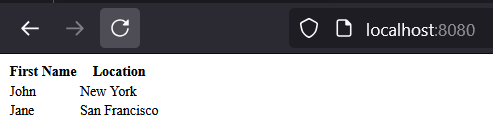

# holbertonschool-web_react

cd task_0
npm install
npm run build

Exécuter le projet avec Webpack
npm install
npm run build
npm start

npm run start-dev
http://localhost:8080

root@UID7E:/holbertonschool-web_react/TypeScript/task_0# npm install
npm run build
npm start

up to date, audited 1082 packages in 10s

128 packages are looking for funding
  run `npm fund` for details

57 vulnerabilities (1 low, 37 moderate, 17 high, 2 critical)

To address issues that do not require attention, run:
  npm audit fix

To address all issues (including breaking changes), run:
  npm audit fix --force

Run `npm audit` for details.

> typescript_dependencies@1.0.0 build
> webpack

Starting type checking service...
Using 1 worker with 2048MB memory limit
Hash: 6a4773145396f434a5fe
Version: webpack 4.47.0
Time: 34089ms
Built at: 01/27/2025 1:10:55 PM
     Asset       Size  Chunks             Chunk Names
 bundle.js   10.7 KiB       0  [emitted]  main
index.html  182 bytes          [emitted]
Entrypoint main = bundle.js
[0] ./js/main.ts 1.26 KiB {0} [built]

WARNING in configuration
The 'mode' option has not been set, webpack will fallback to 'production' for this value. Set 'mode' option to 'development' or 'production' to enable defaults for each environment.
You can also set it to 'none' to disable any default behavior. Learn more: https://webpack.js.org/configuration/mode/
Child html-webpack-plugin for "index.html":
     1 asset
    Entrypoint undefined = index.html
    [2] (webpack)/buildin/global.js 472 bytes {0} [built]
    [3] (webpack)/buildin/module.js 497 bytes {0} [built]
        + 2 hidden modules
npm error Missing script: "start"
npm error
npm error Did you mean one of these?
npm error   npm star # Mark your favorite packages
npm error   npm stars # View packages marked as favorites
npm error
npm error To see a list of scripts, run:
npm error   npm run
npm error A complete log of this run can be found in: /root/.npm/_logs/2025-01-27T12_10_55_649Z-debug-0.log
root@UID7E:holbertonschool-web_react/TypeScript/task_0# npm run start-dev

> typescript_dependencies@1.0.0 start-dev
> webpack-dev-server --open

Starting type checking service...
Using 1 worker with 2048MB memory limit
ℹ ｢wds｣: Project is running at http://localhost:8080/
ℹ ｢wds｣: webpack output is served from /
ℹ ｢wds｣: Content not from webpack is served from ./dist
ℹ ｢wdm｣: wait until bundle finished: /index.html
Type checking in progress...
ℹ ｢wdm｣: Hash: 1caa888c152cdf9e94a3
Version: webpack 4.47.0
Time: 1716ms
Built at: 01/27/2025 1:17:08 PM
     Asset       Size  Chunks             Chunk Names
 bundle.js   1.02 MiB    main  [emitted]  main
index.html  182 bytes          [emitted]
Entrypoint main = bundle.js
[0] multi (webpack)-dev-server/client?http://localhost:8080 ./js/main.ts 40 bytes {main} [built]
[./js/main.ts] 1.26 KiB {main} [built]
[./node_modules/ansi-html-community/index.js] 4.16 KiB {main} [built]
[./node_modules/html-entities/lib/index.js] 449 bytes {main} [built]
[./node_modules/loglevel/lib/loglevel.js] 11.1 KiB {main} [built]
[./node_modules/url/url.js] 23 KiB {main} [built]
[./node_modules/webpack-dev-server/client/index.js?http://localhost:8080] (webpack)-dev-server/client?http://localhost:8080 4.29 KiB {main} [built]
[./node_modules/webpack-dev-server/client/overlay.js] (webpack)-dev-server/client/overlay.js 3.52 KiB {main} [built]
[./node_modules/webpack-dev-server/client/socket.js] (webpack)-dev-server/client/socket.js 1.53 KiB {main} [built]
[./node_modules/webpack-dev-server/client/utils/createSocketUrl.js] (webpack)-dev-server/client/utils/createSocketUrl.js 2.91 KiB {main} [built]
[./node_modules/webpack-dev-server/client/utils/log.js] (webpack)-dev-server/client/utils/log.js 964 bytes {main} [built]
[./node_modules/webpack-dev-server/client/utils/reloadApp.js] (webpack)-dev-server/client/utils/reloadApp.js 1.59 KiB {main} [built]
[./node_modules/webpack-dev-server/client/utils/sendMessage.js] (webpack)-dev-server/client/utils/sendMessage.js 402 bytes {main} [built]
[./node_modules/webpack-dev-server/node_modules/strip-ansi/index.js] (webpack)-dev-server/node_modules/strip-ansi/index.js 161 bytes {main} [built]
[./node_modules/webpack/hot sync ^\.\/log$] (webpack)/hot sync nonrecursive ^\.\/log$ 170 bytes {main} [built]
    + 61 hidden modules
Child html-webpack-plugin for "index.html":
     1 asset
    Entrypoint undefined = index.html
    [./node_modules/html-webpack-plugin/lib/loader.js!./node_modules/html-webpack-plugin/default_index.ejs] 376 bytes {0} [built]
    [./node_modules/lodash/lodash.js] 531 KiB {0} [built]
    [./node_modules/webpack/buildin/global.js] (webpack)/buildin/global.js 472 bytes {0} [built]
    [./node_modules/webpack/buildin/module.js] (webpack)/buildin/module.js 497 bytes {0} [built]
ℹ ｢wdm｣: Compiled successfully.
No type errors found
Version: typescript 3.9.10
Time: 34396ms

root@UID7E:/mnt/c/Users/steph/Documents/3ème trimestre/holbertonschool-web_react/TypeScript/task_0# npm run build

> typescript_dependencies@1.0.0 build
> webpack

Starting type checking service...
Using 1 worker with 2048MB memory limit
Hash: 6a4773145396f434a5fe
Version: webpack 4.47.0
Time: 36160ms
Built at: 01/27/2025 3:51:58 PM
     Asset       Size  Chunks             Chunk Names
 bundle.js   10.7 KiB       0  [emitted]  main
index.html  182 bytes          [emitted]
Entrypoint main = bundle.js
[0] ./js/main.ts 1.26 KiB {0} [built]

WARNING in configuration
The 'mode' option has not been set, webpack will fallback to 'production' for this value. Set 'mode' option to 'development' or 'production' to enable defaults for each environment.
You can also set it to 'none' to disable any default behavior. Learn more: https://webpack.js.org/configuration/mode/
Child html-webpack-plugin for "index.html":
     1 asset
    Entrypoint undefined = index.html
    [2] (webpack)/buildin/global.js 472 bytes {0} [built]
    [3] (webpack)/buildin/module.js 497 bytes {0} [built]
        + 2 hidden modules
root@UID7E:/mnt/c/Users/steph/Documents/3ème trimestre/holbertonschool-web_react/TypeScript/task_0#

root@UID7E:/mnt/c/Users/steph/Documents/3ème trimestre/holbertonschool-web_react/TypeScript/task_0# npm run start-dev

> typescript_dependencies@1.0.0 start-dev
> webpack-dev-server --open

Starting type checking service...
Using 1 worker with 2048MB memory limit
ℹ ｢wds｣: Project is running at http://localhost:8080/
ℹ ｢wds｣: webpack output is served from /
ℹ ｢wds｣: Content not from webpack is served from ./dist
ℹ ｢wdm｣: wait until bundle finished: /
Type checking in progress...
ℹ ｢wdm｣: Hash: 1caa888c152cdf9e94a3
Version: webpack 4.47.0
Time: 1606ms
Built at: 01/27/2025 3:54:37 PM
     Asset       Size  Chunks             Chunk Names
 bundle.js   1.02 MiB    main  [emitted]  main
index.html  182 bytes          [emitted]
Entrypoint main = bundle.js
[0] multi (webpack)-dev-server/client?http://localhost:8080 ./js/main.ts 40 bytes {main} [built]
[./js/main.ts] 1.26 KiB {main} [built]
[./node_modules/ansi-html-community/index.js] 4.16 KiB {main} [built]
[./node_modules/html-entities/lib/index.js] 449 bytes {main} [built]
[./node_modules/loglevel/lib/loglevel.js] 11.1 KiB {main} [built]
[./node_modules/url/url.js] 23 KiB {main} [built]
[./node_modules/webpack-dev-server/client/index.js?http://localhost:8080] (webpack)-dev-server/client?http://localhost:8080 4.29 KiB {main} [built]
[./node_modules/webpack-dev-server/client/overlay.js] (webpack)-dev-server/client/overlay.js 3.52 KiB {main} [built]
[./node_modules/webpack-dev-server/client/socket.js] (webpack)-dev-server/client/socket.js 1.53 KiB {main} [built]
[./node_modules/webpack-dev-server/client/utils/createSocketUrl.js] (webpack)-dev-server/client/utils/createSocketUrl.js 2.91 KiB {main} [built]
[./node_modules/webpack-dev-server/client/utils/log.js] (webpack)-dev-server/client/utils/log.js 964 bytes {main} [built]
[./node_modules/webpack-dev-server/client/utils/reloadApp.js] (webpack)-dev-server/client/utils/reloadApp.js 1.59 KiB {main} [built]
[./node_modules/webpack-dev-server/client/utils/sendMessage.js] (webpack)-dev-server/client/utils/sendMessage.js 402 bytes {main} [built]
[./node_modules/webpack-dev-server/node_modules/strip-ansi/index.js] (webpack)-dev-server/node_modules/strip-ansi/index.js 161 bytes {main} [built]
[./node_modules/webpack/hot sync ^\.\/log$] (webpack)/hot sync nonrecursive ^\.\/log$ 170 bytes {main} [built]
    + 61 hidden modules
Child html-webpack-plugin for "index.html":
     1 asset
    Entrypoint undefined = index.html
    [./node_modules/html-webpack-plugin/lib/loader.js!./node_modules/html-webpack-plugin/default_index.ejs] 376 bytes {0} [built]
    [./node_modules/lodash/lodash.js] 531 KiB {0} [built]
    [./node_modules/webpack/buildin/global.js] (webpack)/buildin/global.js 472 bytes {0} [built]
    [./node_modules/webpack/buildin/module.js] (webpack)/buildin/module.js 497 bytes {0} [built]
ℹ ｢wdm｣: Compiled successfully.

npm audit
found 0 vulnerabilities
j'ai 57 vulnerabilities (1 low, 37 moderate, 17 high, 2 critical)

fix
To address issues that do not require attention, run:
  npm audit fix

To address all issues (including breaking changes), run:
  npm audit fix --force

Run `npm audit` for details.
