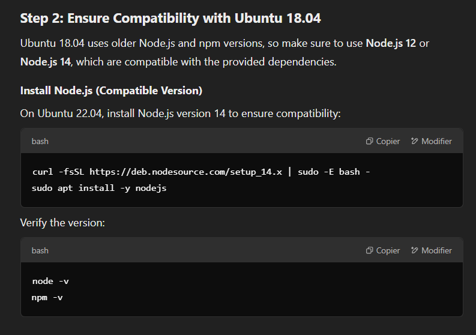
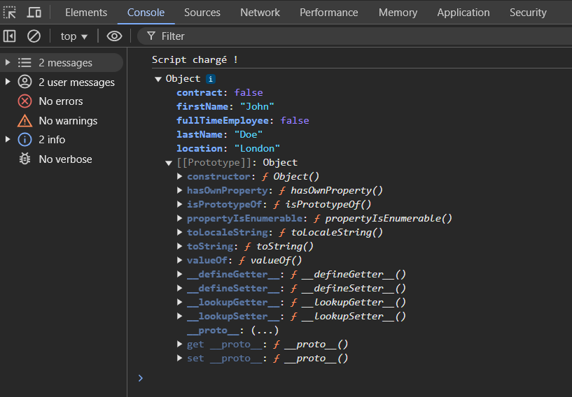

# holbertonschool-web_react

Step 2: Ensure Compatibility with Ubuntu 18.04
Ubuntu 18.04 uses older Node.js and npm versions, so make sure to use Node.js 12 or Node.js 14, which are compatible with the provided dependencies.

Install Node.js (Compatible Version)
On Ubuntu 22.04, install Node.js version 14 to ensure compatibility:

bash
Copier
Modifier
curl -fsSL https://deb.nodesource.com/setup_14.x | sudo -E bash -
sudo apt install -y nodejs
Verify the version:

bash
Copier
Modifier
node -v
npm -v

Step 3: Install Project Dependencies
Navigate to your project directory and install the dependencies:

bash
Copier
Modifier
npm install
Step 4: Compile and Run the Project
Build the project:

bash
Copier
Modifier
npm run build
This will create the dist/bundle.js file.

Start the development server:

bash
Copier
Modifier
npm run start-dev
This will open the project in your default browser.

Run the tests:

bash
Copier
Modifier
npm run test

npm install
npm run build
npm start

{
    "firstName": "John",
    "lastName": "Doe",
    "fullTimeEmployee": false,
    "location": "London",
    "contract": false
}

