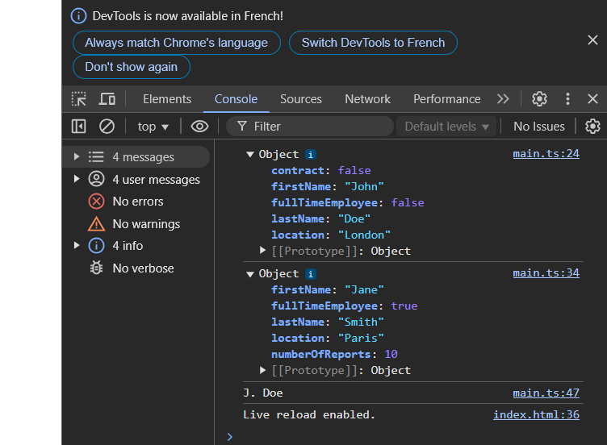

# holbertonschool-web_react

  // Define the interface for the printTeacher function
  interface printTeacherFunction {
	(firstName: string, lastName: string): string;
  }

  // Implement the printTeacher function
  const printTeacher: printTeacherFunction = (firstName, lastName) => {
	return `${firstName.charAt(0)}. ${lastName}`;
  };

  // Example usage of printTeacher
  console.log(printTeacher("John", "Doe")); // Output: J. Doe
