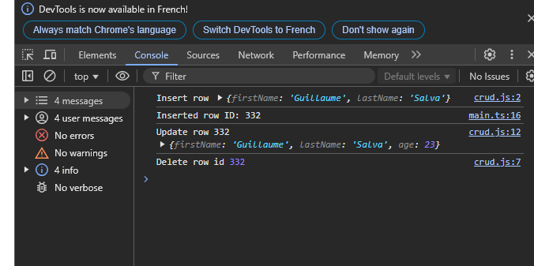

# holbertonschool-web_react

// task_3/js/interface.ts
export type RowID = number;

export interface RowElement {
  firstName: string;
  lastName: string;
  age?: number;
}

// task_3/js/crud.d.ts
import { RowID, RowElement } from "./interface";

declare module "./crud" {
  export function insertRow(row: RowElement): RowID;
  export function deleteRow(rowId: RowID): void;
  export function updateRow(rowId: RowID, row: RowElement): RowID;
}

// task_3/js/main.ts
/// <reference path="./crud.d.ts" />

import { RowID, RowElement } from "./interface";
import * as CRUD from "./crud";

const row: RowElement = {
  firstName: "Guillaume",
  lastName: "Salva",
};

const newRowID: RowID = CRUD.insertRow(row);

const updatedRow: RowElement = {
  ...row,
  age: 23,
};

CRUD.updateRow(newRowID, updatedRow);
CRUD.deleteRow(newRowID);
