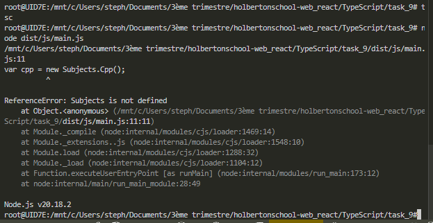

# holbertonschool-web_react

// {
// 	"name": "typescript_dependencies",
// 	"version": "1.0.0",
// 	"description": "",
// 	"main": "index.js",
// 	"scripts": {
// 	  "start-dev": "webpack-dev-server --open",
// 	  "build": "webpack",
// 	  "test": "jest"
// 	},
// 	"keywords": [],
// 	"author": "",
// 	"license": "ISC",
// 	"devDependencies": {
// 	  "@babel/plugin-proposal-export-default-from": "^7.5.2",
// 	  "@babel/preset-typescript": "^7.7.2",
// 	  "@types/jest": "^24.0.23",
// 	  "@typescript-eslint/eslint-plugin": "^2.4.0",
// 	  "@typescript-eslint/parser": "^2.4.0",
// 	  "clean-webpack-plugin": "^3.0.0",
// 	  "fork-ts-checker-webpack-plugin": "^1.5.1",
// 	  "html-webpack-plugin": "^3.2.0",
// 	  "jest": "^24.9.0",
// 	  "source-map": "^0.7.3",
// 	  "ts-jest": "^24.1.0",
// 	  "ts-loader": "^6.2.0",
// 	  "typescript": "^3.6.4",
// 	  "webpack": "^4.41.2",
// 	  "webpack-cli": "^3.3.9",
// 	  "webpack-dev-server": "^3.8.2"
// 	}
//   }

{
	"name": "task_4",
	"version": "1.0.0",
	"description": "",
	"main": "index.js",
	"scripts": {
	  "test": "echo \"Error: no test specified\" && exit 1"
	},
	"keywords": [],
	"author": "",
	"license": "ISC",
	"devDependencies": {
	  "@typescript-eslint/eslint-plugin": "^2.4.0",
	  "@typescript-eslint/parser": "^2.4.0",
	  "typescript": "^3.6.4"
	}
  }

// task_4/js/subjects/Teacher.ts
namespace Subjects {
  export interface Teacher {
    firstName: string;
    lastName: string;
  }
}

// task_4/js/subjects/Subject.ts
namespace Subjects {
  export class Subject {
    teacher: Teacher;

    setTeacher(teacher: Teacher): void {
      this.teacher = teacher;
    }
  }
}

// task_4/js/subjects/Cpp.ts
namespace Subjects {
  export interface Teacher {
    experienceTeachingC?: number;
  }

  export class Cpp extends Subject {
    getRequirements(): string {
      return "Here is the list of requirements for Cpp";
    }

    getAvailableTeacher(): string {
      if (!this.teacher.experienceTeachingC) {
        return "No available teacher";
      }
      return `Available Teacher: ${this.teacher.firstName}`;
    }
  }
}

// task_4/js/subjects/React.ts
namespace Subjects {
  export interface Teacher {
    experienceTeachingReact?: number;
  }

  export class React extends Subject {
    getRequirements(): string {
      return "Here is the list of requirements for React";
    }

    getAvailableTeacher(): string {
      if (!this.teacher.experienceTeachingReact) {
        return "No available teacher";
      }
      return `Available Teacher: ${this.teacher.firstName}`;
    }
  }
}

// task_4/js/subjects/Java.ts
namespace Subjects {
  export interface Teacher {
    experienceTeachingJava?: number;
  }

  export class Java extends Subject {
    getRequirements(): string {
      return "Here is the list of requirements for Java";
    }

    getAvailableTeacher(): string {
      if (!this.teacher.experienceTeachingJava) {
        return "No available teacher";
      }
      return `Available Teacher: ${this.teacher.firstName}`;
    }
  }
}

// import { Subjects } from "./subjects/Teacher";
// import { Cpp } from "./subjects/Cpp";
// import { Java } from "./subjects/Java";
// import { React } from "./subjects/React";

const cpp = new Subjects.Cpp();
const java = new Subjects.Java();
const react = new Subjects.React();

const teacher: Subjects.Teacher = {
  firstName: 'John',
  lastName: 'Doe',
  experienceTeachingC: 10,
  experienceTeachingJava: 5,
  experienceTeachingReact: 0,
};

cpp.setTeacher(teacher);
java.setTeacher(teacher);
react.setTeacher(teacher);

console.log(cpp.getRequirements());
console.log(cpp.getAvailableTeacher());

console.log(java.getRequirements());
console.log(java.getAvailableTeacher());

console.log(react.getRequirements());
console.log(react.getAvailableTeacher());

npm install
tsc
<!-- node dist/main.js -->
node dist/js/main.js

