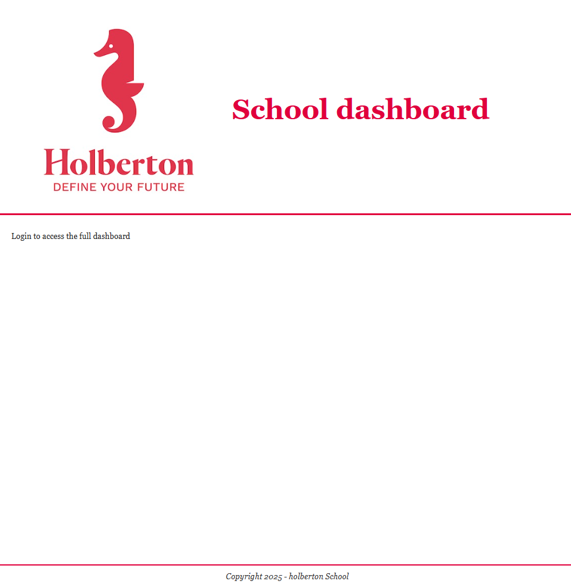
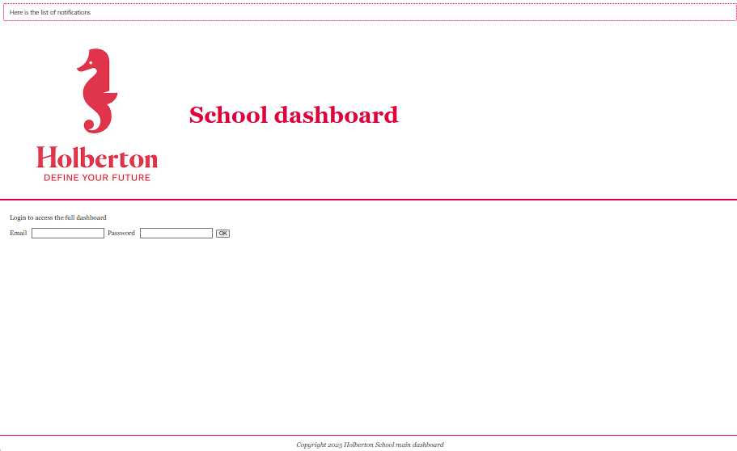
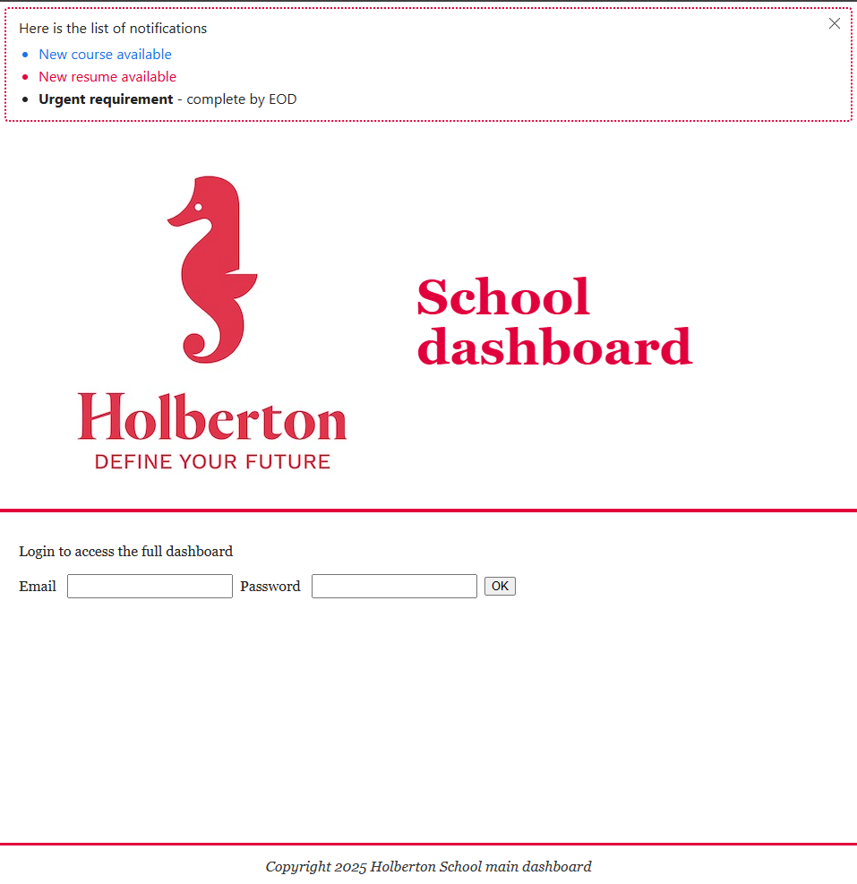
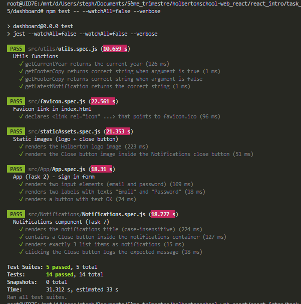

# react_intro

```bash
# depuis react_intro
cd task_0/dashboard

# installe les dépendances (à faire une fois ou si package.json a changé)
npm install

# démarre le serveur Vite
npm run dev


http://localhost:5173/

```

````bash
root@UID7E:/mnt/d/Users/steph/Documents/5ème_trimestre/holbertonschool-web_react/react_
intro/task_0/dashboard# node testRunner.js
✔ index.html existe
✔ public/holberton-logo.jpg présent
✔ public/favicon.ico présent
✔ src/assets/holberton-logo.jpg présent
✔ src/assets/close-button.png présent
✔ public/vite.svg supprimé
✔ src/assets/react.svg supprimé
✔ src/index.css supprimé
✔ src/assets/favicon.ico supprimé
✔ index.html: titre exact
✔ index.html: une seule balise icon (trouvé=1)
✔ index.html: icon pointe vers /holberton-logo.jpg
✔ App.jsx: alt="holberton logo"
✔ App.jsx: h1 "School dashboard"
✔ App.jsx: texte de login
✖ App.jsx: footer avec l'année 2025
✔ App.css: contient #e1003c
✔ main.jsx: pas d'import de index.css
✔ package.json: dépendance jest présente
✔ package.json: bloc de config jest présent
NOK
root@UID7E:/mnt/d/Users/steph/Documents/5ème_trimestre/holbertonschool-web_react/react_
intro/task_0/dashboard# node testRunner.js
✔ index.html existe
✔ public/holberton-logo.jpg présent
✔ public/favicon.ico présent
✔ src/assets/holberton-logo.jpg présent
✔ src/assets/close-button.png présent
✔ public/vite.svg supprimé
✔ src/assets/react.svg supprimé
✔ src/index.css supprimé
✔ src/assets/favicon.ico supprimé
✔ index.html: titre exact
✔ index.html: une seule balise icon (trouvé=1)
✔ index.html: icon pointe vers /holberton-logo.jpg
✔ App.jsx: alt="holberton logo"
✔ App.jsx: h1 "School dashboard"
✔ App.jsx: texte de login
✔ App.jsx: footer avec l'année 2025 (ou {year}/getFullYear())
✔ App.css: contient #e1003c
✔ main.jsx: pas d'import de index.css
✔ package.json: dépendance jest présente
✔ package.json: bloc de config jest présent
OK
```

```bash
root@UID7E:/mnt/d/Users/steph/Documents/5ème_trimestre/holbertonschool-web_react/react_
intro/task_0/dashboard# npm run dev

> dashboard@0.0.0 dev
> vite


  VITE v5.4.20  ready in 831 ms

  ➜  Local:   http://localhost:5173/
  ➜  Network: use --host to expose
  ➜  press h + enter to show help
```




# Task1
```bash
npm test
```

```bash
root@UID7E:/mnt/d/Users/steph/Documents/5ème_trimestre/holbertonschool-web_rea
ct/react_intro/task_0/dashboard# npm test

> dashboard@0.0.0 test
> jest --watchAll=false

 PASS  src/App.spec.js (34.853 s)
  App (Task 0)
    ✓ renders the <h1> with text "School dashboard" (70 ms)
    ✓ renders body and footer texts in the right sections (9 ms)
    ✓ renders the Holberton logo image (16 ms)

Test Suites: 1 passed, 1 total
Tests:       3 passed, 3 total
Snapshots:   0 total
Time:        47.468 s
Ran all test suites.
root@UID7E:/mnt/d/Users/steph/Documents/5ème_trimestre/holbertonschool-web_rea
ct/react_intro/task_0/dashboard#

root@UID7E:/mnt/d/Users/steph/Documents/5ème_trimestre/holbertonschool-web_rea
ct/react_intro/task_0/dashboard# npm test

> dashboard@0.0.0 test
> jest --watchAll=false

 PASS  src/App.spec.js (34.009 s)
  App (Task 0)
    ✓ renders the <h1> with text "School dashboard" (66 ms)
    ✓ renders body/footer texts and the logo image (16 ms)

Test Suites: 1 passed, 1 total
Tests:       2 passed, 2 total
Snapshots:   0 total
Time:        47.808 s
Ran all test suites.
root@UID7E:/mnt/d/Users/steph/Documents/5ème_trimestre/holbertonschool-web_rea
ct/react_intro/task_0/dashboard#
```


# Task2

```bash

```

```bash
root@UID7E:/mnt/d/Users/steph/Documents/5ème_trimestre/holbertonschool-web_rea
ct/react_intro/task_1/dashboard# npm install

up to date, audited 542 packages in 6s

82 packages are looking for funding
  run `npm fund` for details

2 moderate severity vulnerabilities

To address all issues (including breaking changes), run:
  npm audit fix --force

Run `npm audit` for details.
root@UID7E:/mnt/d/Users/steph/Documents/5ème_trimestre/holbertonschool-web_rea
ct/react_intro/task_1/dashboard# npm run dev

> dashboard@0.0.0 dev
> vite

Re-optimizing dependencies because vite config has changed

  VITE v5.4.20  ready in 691 ms

  ➜  Local:   http://localhost:5173/
  ➜  Network: use --host to expose
  ➜  press h + enter to show help

```


# Task3

```bash
root@UID7E:/mnt/d/Users/steph/Documents/5ème_trimestre/holbertonschool-web_rea
ct/react_intro/task_2/dashboard# npm install

up to date, audited 542 packages in 8s

82 packages are looking for funding
  run `npm fund` for details

2 moderate severity vulnerabilities

To address all issues (including breaking changes), run:
  npm audit fix --force

Run `npm audit` for details.
root@UID7E:/mnt/d/Users/steph/Documents/5ème_trimestre/holbertonschool-web_rea
ct/react_intro/task_2/dashboard# npm run dev

> dashboard@0.0.0 dev
> vite

Re-optimizing dependencies because vite config has changed

  VITE v5.4.20  ready in 907 ms

  ➜  Local:   http://localhost:5173/
  ➜  Network: use --host to expose
  ➜  press h + enter to show help


```


# Task4

```bash
root@UID7E:/mnt/d/Users/steph/Documents/5ème_trimestre/holbertonschool-web_rea
ct/react_intro/task_2/dashboard# npm test

> dashboard@0.0.0 test
> jest --watchAll=false

 PASS  src/App.spec.js (35.157 s)
  App (Task 2) - sign in form
    ✓ renders two input elements (email and password) (48 ms)
    ✓ renders two labels with texts "Email" and "Password" (12 ms)
    ✓ renders a button with text OK (70 ms)

Test Suites: 1 passed, 1 total
Tests:       3 passed, 3 total
Snapshots:   0 total
Time:        51.633 s
Ran all test suites.
root@UID7E:/mnt/d/Users/steph/Documents/5ème_trimestre/holbertonschool-web_rea
ct/react_intro/task_2/dashboard#

```

# Task5

```bash
root@UID7E:/mnt/d/Users/steph/Documents/5ème_trimestre/holbertonschool-web_react/react_
intro/task_2/dashboard# npm run dev

> dashboard@0.0.0 dev
> vite


  VITE v5.4.20  ready in 415 ms

  ➜  Local:   http://localhost:5173/
  ➜  Network: use --host to expose
  ➜  press h + enter to show help
```


# Task6

```bash
root@UID7E:/mnt/d/Users/steph/Documents/5ème_trimestre/holbertonschool-web_react/react_
intro/task_3/dashboard# npm test

> dashboard@0.0.0 test
> jest --watchAll=false

 PASS  src/utils.spec.js (9.627 s)
 PASS  src/App.spec.js (18.77 s)

Test Suites: 2 passed, 2 total
Tests:       7 passed, 7 total
Snapshots:   0 total
Time:        40.462 s
Ran all test suites.
root@UID7E:/mnt/d/Users/steph/Documents/5ème_trimestre/holbertonschool-web_react/react_
intro/task_3/dashboard#
```

# Task7

```bash
root@UID7E:/mnt/d/Users/steph/Documents/5ème_trimestre/holbertonschool-web_react/react_
intro/task_3/dashboard# npm test

> dashboard@0.0.0 test
> jest --watchAll=false

 PASS  src/App.spec.js (11.884 s)
 PASS  src/Notifications.spec.js (12.377 s)
 PASS  src/utils.spec.js (30.995 s)

Test Suites: 3 passed, 3 total
Tests:       11 passed, 11 total
Snapshots:   0 total
Time:        26.541 s
Ran all test suites.
root@UID7E:/mnt/d/Users/steph/Documents/5ème_trimestre/holbertonschool-web_react/react_
intro/task_3/dashboard#


root@UID7E:/mnt/d/Users/steph/Documents/5ème_trimestre/holbertonschool-web_react/react_
intro/task_3/dashboard# npm install --save-dev @babel/core @babel/preset-react @babel/register

added 20 packages, and audited 562 packages in 4s

82 packages are looking for funding
  run `npm fund` for details

2 moderate severity vulnerabilities

To address all issues (including breaking changes), run:
  npm audit fix --force

Run `npm audit` for details.


root@UID7E:/mnt/d/Users/steph/Documents/5ème_trimestre/holbertonschool-web_react/react_intro/t
ask_3/dashboard# npm test -- src/Notifications.spec.js --watchAll=false

> dashboard@0.0.0 test
> jest --watchAll=false src/Notifications.spec.js --watchAll=false

 PASS  src/Notifications.spec.js (28.959 s)
  Notifications component
    ✓ renders the notifications title (46 ms)
    ✓ renders the close button (64 ms)
    ✓ renders 3 list items (23 ms)
    ✓ logs message when close button is clicked (15 ms)

Test Suites: 1 passed, 1 total
Tests:       4 passed, 4 total
Snapshots:   0 total
Time:        41.098 s, estimated 48 s
Ran all test suites matching /src\/Notifications.spec.js/i.
root@UID7E:/mnt/d/Users/steph/Documents/5ème_trimestre/holbertonschool-web_react/react_intro/t
ask_3/dashboard#


root@UID7E:/mnt/d/Users/steph/Documents/5ème_trimestre/holbertonschool-web_react/react_intro/t
ask_3/dashboard# npm test -- src/Notifications.spec.js --watchAll=false

> dashboard@0.0.0 test
> jest --watchAll=false src/Notifications.spec.js --watchAll=false

 PASS  src/Notifications.spec.js (27.04 s)
  Notifications component (Task 7)
    ✓ renders the notifications title (case-insensitive) (50 ms)
    ✓ contains a Close button inside the notifications container (64 ms)
    ✓ renders exactly 3 list items as notifications (18 ms)
    ✓ clicking the Close button logs the expected message (25 ms)

Test Suites: 1 passed, 1 total
Tests:       4 passed, 4 total
Snapshots:   0 total
Time:        40.929 s
Ran all test suites matching /src\/Notifications.spec.js/i.
root@UID7E:/mnt/d/Users/steph/Documents/5ème_trimestre/holbertonschool-web_react/react_intro/t
ask_3/dashboard#
```

# Task8

```bash
root@UID7E:/mnt/d/Users/steph/Documents/5ème_trimestre/holbertonschool-web_react/react_intro/t
ask_4# cd dashboard/
root@UID7E:/mnt/d/Users/steph/Documents/5ème_trimestre/holbertonschool-web_react/react_intro/t
ask_4/dashboard# npm install gh-pages --save-dev

added 33 packages, and audited 595 packages in 5s

88 packages are looking for funding
  run `npm fund` for details

2 moderate severity vulnerabilities

To address all issues (including breaking changes), run:
  npm audit fix --force

Run `npm audit` for details.
root@UID7E:/mnt/d/Users/steph/Documents/5ème_trimestre/holbertonschool-web_react/react_intro/t
ask_4/dashboard#

root@UID7E:/mnt/d/Users/steph/Documents/5ème_trimestre/holbertonschool-web_react/react_intro/t
ask_4/dashboard# npm install

up to date, audited 595 packages in 2s

88 packages are looking for funding
  run `npm fund` for details

2 moderate severity vulnerabilities

To address all issues (including breaking changes), run:
  npm audit fix --force

Run `npm audit` for details.
root@UID7E:/mnt/d/Users/steph/Documents/5ème_trimestre/holbertonschool-web_react/react_intro/t
ask_4/dashboard# npm run deploy

> dashboard@0.0.0 predeploy
> npm run build


> dashboard@0.0.0 build
> vite build

vite v5.4.20 building for production...
✓ 31 modules transformed.
dist/index.html                            0.85 kB │ gzip:  0.36 kB
dist/assets/holberton-logo-CIW0R4GT.jpg   23.64 kB
dist/assets/index-Dblg1SDK.css             1.43 kB │ gzip:  0.62 kB
dist/assets/index-CDO-CCUI.js            146.74 kB │ gzip: 49.08 kB
✓ built in 1.80s

> dashboard@0.0.0 postbuild
> cp dist/index.html dist/404.html || copy dist\index.html dist\404.html


> dashboard@0.0.0 deploy
> gh-pages -d dist

Published
root@UID7E:/mnt/d/Users/steph/Documents/5ème_trimestre/holbertonschool-web_react/react_intro/t
ask_4/dashboard#


```

```bash
# 1) Crée/écrase vite.config.js avec la base correcte
echo "import { defineConfig } from 'vite'
import react from '@vitejs/plugin-react'

export default defineConfig({
  plugins: [react()],
  base: '/holbertonschool-web_react/'
})" > vite.config.js

# 2) Rebuild et déploie sur GitHub Pages
npm run build
npm run deploy

# 3) Crée le fichier avec l'URL demandée
echo "https://SDINAHET.github.io/holbertonschool-web_react" > holberton-dashboard.txt

# 4) Commit et push
git add vite.config.js holberton-dashboard.txt
git commit -m "Add vite.config.js, deploy site, and add holberton-dashboard.txt"
git push
```

```bash
root@UID7E:/mnt/d/Users/steph/Documents/5ème_trimestre/holbertonschool-web_react/react_intro/t
ask_4/dashboard# npm install
npm run install:browsers   # (si demandé par le correcteur)
npm run deploy

up to date, audited 595 packages in 2s

88 packages are looking for funding
  run `npm fund` for details

2 moderate severity vulnerabilities

To address all issues (including breaking changes), run:
  npm audit fix --force

Run `npm audit` for details.

> dashboard@0.0.0 install:browsers
> npx playwright install chromium-headless-shell

Need to install the following packages:
playwright@1.55.1
Ok to proceed? (y) y

╔═══════════════════════════════════════════════════════════════════════════════╗
║ WARNING: It looks like you are running 'npx playwright install' without first ║
║ installing your project's dependencies.                                       ║
║                                                                               ║
║ To avoid unexpected behavior, please install your dependencies first, and     ║
║ then run Playwright's install command:                                        ║
║                                                                               ║
║     npm install                                                               ║
║     npx playwright install                                                    ║
║                                                                               ║
║ If your project does not yet depend on Playwright, first install the          ║
║ applicable npm package (most commonly @playwright/test), and                  ║
║ then run Playwright's install command to download the browsers:               ║
║                                                                               ║
║     npm install @playwright/test                                              ║
║     npx playwright install                                                    ║
║                                                                               ║
╚═══════════════════════════════════════════════════════════════════════════════╝
Downloading Chromium Headless Shell 140.0.7339.186 (playwright build v1193) from https://cdn.playwright.dev/dbazure/download/playwright/builds/chromium/1193/chromium-headless-shell-linux.zip
104.3 MiB [====================] 100% 0.0s
Chromium Headless Shell 140.0.7339.186 (playwright build v1193) downloaded to /root/.cache/ms-playwright/chromium_headless_shell-1193
Downloading FFMPEG playwright build v1011 from https://cdn.playwright.dev/dbazure/download/playwright/builds/ffmpeg/1011/ffmpeg-linux.zip
2.3 MiB [====================] 100% 0.0s
FFMPEG playwright build v1011 downloaded to /root/.cache/ms-playwright/ffmpeg-1011

> dashboard@0.0.0 predeploy
> npm run build


> dashboard@0.0.0 build
> vite build

vite v5.4.20 building for production...
✓ 36 modules transformed.
dist/index.html                            0.58 kB │ gzip:  0.36 kB
dist/assets/holberton-logo-CIW0R4GT.jpg   23.64 kB
dist/assets/index-Dblg1SDK.css             1.43 kB │ gzip:  0.62 kB
dist/assets/index-WuqLIXZM.js            147.55 kB │ gzip: 49.22 kB
✓ built in 1.45s

> dashboard@0.0.0 postbuild
> cp dist/index.html dist/404.html || copy dist\index.html dist\404.html


> dashboard@0.0.0 deploy
> gh-pages -d dist

Published
root@UID7E:/mnt/d/Users/steph/Documents/5ème_trimestre/holbertonschool-web_react/react_intro/t
ask_4/dashboard#


root@UID7E:/mnt/d/Users/steph/Documents/5ème_trimestre/holbertonschool-web_react/react_intro/t
ask_4/dashboard# # 1. Le close button
grep -R 'close-button.png' -n src
grep -R 'alt="close"' -n src/Notifications.jsx

# 2. Le logo Holberton
grep -R 'holberton-logo.jpg' -n src
grep -R 'alt="holberton logo"' -n src/App.jsx

# 3. Le favicon en chemin relatif dans index.html
grep -n 'rel="icon"' index.html
# → doit afficher href="favicon.ico"
src/Notifications.jsx:4:import closeButton from './assets/close-button.png';   // <-- nom attendu
36:        
43:        
src/App.jsx:2:import logo from "./assets/holberton-logo.jpg";
14:        
5:    <!-- <link rel="icon" href="favicon.ico" /> -->
6:    <link rel="icon" href="/holbertonschool-web_react/favicon.ico" />
root@UID7E:/mnt/d/Users/steph/Documents/5ème_trimestre/holbertonschool-web_react/react_intro/t
ask_4/dashboard#


```
https://sdinahet.github.io/holbertonschool-web_react/




# Task9

```bash
task_5/dashboard/
├─ public/
│  └─ favicon.ico
├─ src/
│  ├─ App/
│  │  ├─ App.jsx
│  │  └─ App.css
│  ├─ Notifications/
│  │  ├─ Notifications.jsx
│  │  └─ Notifications.css
│  ├─ utils/
│  │  ├─ utils.js
│  │  └─ utils.spec.js
│  ├─ assets/
│  │  ├─ holberton-logo.jpg
│  │  └─ close-button.png
│  ├─ main.jsx
│  └─ index.css (if you have one)
├─ package.json
└─ vite.config.js


```

```bash
root@UID7E:/mnt/d/Users/steph/Documents/5ème_trimestre/holbertonschool-web_react/react_intro/task_
5/dashboard# npm test -- --watchAll=false --verbose

> dashboard@0.0.0 test
> jest --watchAll=false --watchAll=false --verbose

 PASS  src/favicon.spec.js (22.69 s)
  Favicon link in index.html
    ✓ declares <link rel="icon" ...> that points to favicon.ico (150 ms)

 PASS  src/App/App.spec.js (25.522 s)
  App (Task 2) - sign in form
    ✓ renders two input elements (email and password) (138 ms)
    ✓ renders two labels with texts "Email" and "Password" (18 ms)
    ✓ renders a button with text OK (59 ms)

 PASS  src/utils/utils.spec.js (22.094 s)
  Utils functions
    ✓ getCurrentYear returns the current year (94 ms)
    ✓ getFooterCopy returns correct string when argument is true (1 ms)
    ✓ getFooterCopy returns correct string when argument is false
    ✓ getLatestNotification returns the correct string

 FAIL  src/staticAssets.spec.js
  ● Test suite failed to run

    Cannot find module './App' from 'src/staticAssets.spec.js'

      1 | import React from "react";
      2 | import { render, screen, within } from "@testing-library/react";
    > 3 | import App from "./App";
        | ^
      4 |
      5 | describe("Static images (logo + close button)", () => {
      6 |   test("renders the Holberton logo image", () => {

      at Resolver._throwModNotFoundError (node_modules/jest-resolve/build/resolver.js:427:11)
      at Object.require (src/staticAssets.spec.js:3:1)

 PASS  src/Notifications/Notifications.spec.js (32.504 s)
  Notifications component (Task 7)
    ✓ renders the notifications title (case-insensitive) (125 ms)
    ✓ contains a Close button inside the notifications container (47 ms)
    ✓ renders exactly 3 list items as notifications (12 ms)
    ✓ clicking the Close button logs the expected message (15 ms)

Test Suites: 1 failed, 4 passed, 5 total
Tests:       12 passed, 12 total
Snapshots:   0 total
Time:        50.317 s
Ran all test suites.
root@UID7E:/mnt/d/Users/steph/Documents/5ème_trimestre/holbertonschool-web_react/react_intro/task_
5/dashboard#


root@UID7E:/mnt/d/Users/steph/Documents/5ème_trimestre/holbertonschool-web_react/react_intro/task_
5/dashboard# npm test -- --watchAll=false --verbose

> dashboard@0.0.0 test
> jest --watchAll=false --watchAll=false --verbose

 PASS  src/utils/utils.spec.js (10.659 s)
  Utils functions
    ✓ getCurrentYear returns the current year (126 ms)
    ✓ getFooterCopy returns correct string when argument is true (1 ms)
    ✓ getFooterCopy returns correct string when argument is false
    ✓ getLatestNotification returns the correct string (1 ms)

 PASS  src/favicon.spec.js (22.561 s)
  Favicon link in index.html
    ✓ declares <link rel="icon" ...> that points to favicon.ico (96 ms)

 PASS  src/staticAssets.spec.js (21.353 s)
  Static images (logo + close button)
    ✓ renders the Holberton logo image (223 ms)
    ✓ renders the Close button image inside the Notifications close button (51 ms)

 PASS  src/App/App.spec.js (18.31 s)
  App (Task 2) - sign in form
    ✓ renders two input elements (email and password) (169 ms)
    ✓ renders two labels with texts "Email" and "Password" (18 ms)
    ✓ renders a button with text OK (74 ms)

 PASS  src/Notifications/Notifications.spec.js (18.727 s)
  Notifications component (Task 7)
    ✓ renders the notifications title (case-insensitive) (224 ms)
    ✓ contains a Close button inside the notifications container (127 ms)
    ✓ renders exactly 3 list items as notifications (15 ms)
    ✓ clicking the Close button logs the expected message (18 ms)

Test Suites: 5 passed, 5 total
Tests:       14 passed, 14 total
Snapshots:   0 total
Time:        31.312 s, estimated 33 s
Ran all test suites.
root@UID7E:/mnt/d/Users/steph/Documents/5ème_trimestre/holbertonschool-web_react/react_intro/task_
5/dashboard#

```

