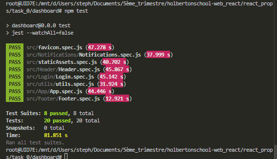
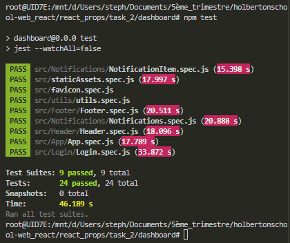

react_props

# Task0
```bash
root@UID7E:/mnt/d/Users/steph/Documents/5ème_trimestre/holbertonschool-web_react/react_prop
s/task_0/dashboard# npm test

> dashboard@0.0.0 test
> jest --watchAll=false

 PASS  src/favicon.spec.js (47.278 s)
 PASS  src/Notifications/Notifications.spec.js (37.999 s)
 PASS  src/staticAssets.spec.js (40.702 s)
 PASS  src/Header/Header.spec.js (45.867 s)
 PASS  src/Login/Login.spec.js (45.142 s)
 PASS  src/utils/utils.spec.js (31.924 s)
 PASS  src/App/App.spec.js (44.446 s)
 PASS  src/Footer/Footer.spec.js (12.921 s)

Test Suites: 8 passed, 8 total
Tests:       20 passed, 20 total
Snapshots:   0 total
Time:        81.851 s
Ran all test suites.
root@UID7E:/mnt/d/Users/steph/Documents/5ème_trimestre/holbertonschool-web_react/react_prop
s/task_0/dashboard#
```


# Task1

```bash

```

# Task2

```bash
root@UID7E:/mnt/d/Users/steph/Documents/5ème_trimestre/holbertonscho
ol-web_react/react_props/task_2/dashboard# npm test

> dashboard@0.0.0 test
> jest --watchAll=false

 PASS  src/Notifications/NotificationItem.spec.js (15.398 s)
 PASS  src/staticAssets.spec.js (17.997 s)
 PASS  src/favicon.spec.js
 PASS  src/utils/utils.spec.js
 PASS  src/Footer/Footer.spec.js (20.511 s)
 PASS  src/Notifications/Notifications.spec.js (20.888 s)
 PASS  src/Header/Header.spec.js (18.096 s)
 PASS  src/App/App.spec.js (17.789 s)
 PASS  src/Login/Login.spec.js (33.872 s)

Test Suites: 9 passed, 9 total
Tests:       24 passed, 24 total
Snapshots:   0 total
Time:        46.189 s
Ran all test suites.
root@UID7E:/mnt/d/Users/steph/Documents/5ème_trimestre/holbertonscho
ol-web_react/react_props/task_2/dashboard#
```


# Task3

```bash

```

# Task4

```bash
npm i prop-types
```

```bash
root@UID7E:/mnt/d/Users/steph/Documents/5ème_trimestre/holbertonschool-web_react/react_props/tas
k_4/dashboard# npm install

up to date, audited 601 packages in 2s

88 packages are looking for funding
  run `npm fund` for details

2 moderate severity vulnerabilities

To address all issues (including breaking changes), run:
  npm audit fix --force

Run `npm audit` for details.
root@UID7E:/mnt/d/Users/steph/Documents/5ème_trimestre/holbertonschool-web_react/react_props/task_
4/dashboard# npm test

> dashboard@0.0.0 test
> jest --watchAll=false

 PASS  src/utils/utils.spec.js (12.825 s)
 PASS  src/Header/Header.spec.js (14.853 s)
 PASS  src/Login/Login.spec.js (14.879 s)
 PASS  src/Notifications/NotificationItem.spec.js (18.552 s)
 PASS  src/Notifications/Notifications.spec.js (19.026 s)
 PASS  src/favicon.spec.js (23.381 s)
 PASS  src/CourseList/CourseList.spec.js
  ● Console

    console.error
      Warning: CourseList: Support for defaultProps will be removed from function components in a future major release. Use JavaScript default parameters instead.
          at courses (/mnt/d/Users/steph/Documents/5ème_trimestre/holbertonschool-web_react/react_props/task_4/dashboard/src/CourseList/CourseList.jsx:6:23)

      12 | describe('CourseList', () => {
      13 |   test('renders 5 rows total when it receives a courses array (2 headers + 3 body)', () => {
    > 14 |     render(<CourseList courses={courses} />);
         |           ^
      15 |     const rows = screen.getAllByRole('row');
      16 |     expect(rows).toHaveLength(5);
      17 |   });

      at printWarning (node_modules/react-dom/cjs/react-dom.development.js:86:30)
      at error (node_modules/react-dom/cjs/react-dom.development.js:60:7)
      at validateFunctionComponentInDev (node_modules/react-dom/cjs/react-dom.development.js:20230:9)
      at mountIndeterminateComponent (node_modules/react-dom/cjs/react-dom.development.js:20189:7)
      at beginWork (node_modules/react-dom/cjs/react-dom.development.js:21626:16)
      at beginWork$1 (node_modules/react-dom/cjs/react-dom.development.js:27465:14)
      at performUnitOfWork (node_modules/react-dom/cjs/react-dom.development.js:26599:12)
      at workLoopSync (node_modules/react-dom/cjs/react-dom.development.js:26505:5)
      at renderRootSync (node_modules/react-dom/cjs/react-dom.development.js:26473:7)
      at performConcurrentWorkOnRoot (node_modules/react-dom/cjs/react-dom.development.js:25777:74)
      at flushActQueue (node_modules/react/cjs/react.development.js:2667:24)
      at act (node_modules/react/cjs/react.development.js:2582:11)
      at node_modules/@testing-library/react/dist/act-compat.js:47:25
      at renderRoot (node_modules/@testing-library/react/dist/pure.js:180:26)
      at render (node_modules/@testing-library/react/dist/pure.js:271:10)
      at Object.<anonymous> (src/CourseList/CourseList.spec.js:14:11)

    console.error
      Warning: CourseListRow: Support for defaultProps will be removed from function components in a future major release. Use JavaScript default parameters instead.
          at isHeader (/mnt/d/Users/steph/Documents/5ème_trimestre/holbertonschool-web_react/react_props/task_4/dashboard/src/CourseList/CourseListRow.jsx:4:26)
          at thead
          at table
          at courses (/mnt/d/Users/steph/Documents/5ème_trimestre/holbertonschool-web_react/react_props/task_4/dashboard/src/CourseList/CourseList.jsx:6:23)

      12 | describe('CourseList', () => {
      13 |   test('renders 5 rows total when it receives a courses array (2 headers + 3 body)', ()
 => {
    > 14 |     render(<CourseList courses={courses} />);
         |           ^
      15 |     const rows = screen.getAllByRole('row');
      16 |     expect(rows).toHaveLength(5);
      17 |   });

      at printWarning (node_modules/react-dom/cjs/react-dom.development.js:86:30)
      at error (node_modules/react-dom/cjs/react-dom.development.js:60:7)
      at validateFunctionComponentInDev (node_modules/react-dom/cjs/react-dom.development.js:20230:9)
      at mountIndeterminateComponent (node_modules/react-dom/cjs/react-dom.development.js:20189:7)
      at beginWork (node_modules/react-dom/cjs/react-dom.development.js:21626:16)
      at beginWork$1 (node_modules/react-dom/cjs/react-dom.development.js:27465:14)
      at performUnitOfWork (node_modules/react-dom/cjs/react-dom.development.js:26599:12)
      at workLoopSync (node_modules/react-dom/cjs/react-dom.development.js:26505:5)
      at renderRootSync (node_modules/react-dom/cjs/react-dom.development.js:26473:7)
      at performConcurrentWorkOnRoot (node_modules/react-dom/cjs/react-dom.development.js:25777:74)
      at flushActQueue (node_modules/react/cjs/react.development.js:2667:24)
      at act (node_modules/react/cjs/react.development.js:2582:11)
      at node_modules/@testing-library/react/dist/act-compat.js:47:25
      at renderRoot (node_modules/@testing-library/react/dist/pure.js:180:26)
      at render (node_modules/@testing-library/react/dist/pure.js:271:10)
      at Object.<anonymous> (src/CourseList/CourseList.spec.js:14:11)

 PASS  src/App/App.spec.js (5.106 s)
  ● Console

    console.error
      Warning: App: Support for defaultProps will be removed from function components in a future major release. Use JavaScript default parameters instead.
          at isLoggedIn (/mnt/d/Users/steph/Documents/5ème_trimestre/holbertonschool-web_react/react_props/task_4/dashboard/src/App/App.jsx:16:16)

       7 | describe('App (Task 2) - sign in form', () => {
       8 |   test('renders two input elements (email and password)', () => {
    >  9 |     const { container } = render(<App />);
         |                                 ^
      10 |     expect(screen.getByLabelText(/email/i)).toBeInTheDocument();
      11 |     expect(screen.getByLabelText(/password/i)).toBeInTheDocument();
      12 |     expect(container.querySelectorAll('input')).toHaveLength(2);

      at printWarning (node_modules/react-dom/cjs/react-dom.development.js:86:30)
      at error (node_modules/react-dom/cjs/react-dom.development.js:60:7)
      at validateFunctionComponentInDev (node_modules/react-dom/cjs/react-dom.development.js:20230:9)
      at mountIndeterminateComponent (node_modules/react-dom/cjs/react-dom.development.js:20189:7)
      at beginWork (node_modules/react-dom/cjs/react-dom.development.js:21626:16)
      at beginWork$1 (node_modules/react-dom/cjs/react-dom.development.js:27465:14)
      at performUnitOfWork (node_modules/react-dom/cjs/react-dom.development.js:26599:12)
      at workLoopSync (node_modules/react-dom/cjs/react-dom.development.js:26505:5)
      at renderRootSync (node_modules/react-dom/cjs/react-dom.development.js:26473:7)
      at performConcurrentWorkOnRoot (node_modules/react-dom/cjs/react-dom.development.js:25777:74)
      at flushActQueue (node_modules/react/cjs/react.development.js:2667:24)
      at act (node_modules/react/cjs/react.development.js:2582:11)
      at node_modules/@testing-library/react/dist/act-compat.js:47:25
      at renderRoot (node_modules/@testing-library/react/dist/pure.js:180:26)
      at render (node_modules/@testing-library/react/dist/pure.js:271:10)
      at Object.<anonymous> (src/App/App.spec.js:9:33)

    console.error
      Warning: CourseList: Support for defaultProps will be removed from function components in a future major release. Use JavaScript default parameters instead.
          at courses (/mnt/d/Users/steph/Documents/5ème_trimestre/holbertonschool-web_react/react_props/task_4/dashboard/src/CourseList/CourseList.jsx:6:23)
          at main
          at div
          at isLoggedIn (/mnt/d/Users/steph/Documents/5ème_trimestre/holbertonschool-web_react/react_props/task_4/dashboard/src/App/App.jsx:16:16)

      37 |
      38 |   test('renders CourseList when isLoggedIn is true', () => {
    > 39 |     const { container } = render(<App isLoggedIn />);
         |                                 ^
      40 |     // CourseList table present
      41 |     expect(container.querySelector('#CourseList')).not.toBeNull();
      42 |     // Login form not visible

      at printWarning (node_modules/react-dom/cjs/react-dom.development.js:86:30)
      at error (node_modules/react-dom/cjs/react-dom.development.js:60:7)
      at validateFunctionComponentInDev (node_modules/react-dom/cjs/react-dom.development.js:20230:9)
      at mountIndeterminateComponent (node_modules/react-dom/cjs/react-dom.development.js:20189:7)
      at beginWork (node_modules/react-dom/cjs/react-dom.development.js:21626:16)
      at beginWork$1 (node_modules/react-dom/cjs/react-dom.development.js:27465:14)
      at performUnitOfWork (node_modules/react-dom/cjs/react-dom.development.js:26599:12)
      at workLoopSync (node_modules/react-dom/cjs/react-dom.development.js:26505:5)
      at renderRootSync (node_modules/react-dom/cjs/react-dom.development.js:26473:7)
      at performConcurrentWorkOnRoot (node_modules/react-dom/cjs/react-dom.development.js:25777:74)
      at flushActQueue (node_modules/react/cjs/react.development.js:2667:24)
      at act (node_modules/react/cjs/react.development.js:2582:11)
      at node_modules/@testing-library/react/dist/act-compat.js:47:25
      at renderRoot (node_modules/@testing-library/react/dist/pure.js:180:26)
      at render (node_modules/@testing-library/react/dist/pure.js:271:10)
      at Object.<anonymous> (src/App/App.spec.js:39:33)

    console.error
      Warning: CourseListRow: Support for defaultProps will be removed from function components in a future major release. Use JavaScript default parameters instead.
          at isHeader (/mnt/d/Users/steph/Documents/5ème_trimestre/holbertonschool-web_react/react_props/task_4/dashboard/src/CourseList/CourseListRow.jsx:4:26)
          at thead
          at table
          at courses (/mnt/d/Users/steph/Documents/5ème_trimestre/holbertonschool-web_react/react_props/task_4/dashboard/src/CourseList/CourseList.jsx:6:23)
          at main
          at div
          at isLoggedIn (/mnt/d/Users/steph/Documents/5ème_trimestre/holbertonschool-web_react/react_props/task_4/dashboard/src/App/App.jsx:16:16)

      37 |
      38 |   test('renders CourseList when isLoggedIn is true', () => {
    > 39 |     const { container } = render(<App isLoggedIn />);
         |                                 ^
      40 |     // CourseList table present
      41 |     expect(container.querySelector('#CourseList')).not.toBeNull();
      42 |     // Login form not visible

      at printWarning (node_modules/react-dom/cjs/react-dom.development.js:86:30)
      at error (node_modules/react-dom/cjs/react-dom.development.js:60:7)
      at validateFunctionComponentInDev (node_modules/react-dom/cjs/react-dom.development.js:20230:9)
      at mountIndeterminateComponent (node_modules/react-dom/cjs/react-dom.development.js:20189:7)
      at beginWork (node_modules/react-dom/cjs/react-dom.development.js:21626:16)
      at beginWork$1 (node_modules/react-dom/cjs/react-dom.development.js:27465:14)
      at performUnitOfWork (node_modules/react-dom/cjs/react-dom.development.js:26599:12)
      at workLoopSync (node_modules/react-dom/cjs/react-dom.development.js:26505:5)
      at renderRootSync (node_modules/react-dom/cjs/react-dom.development.js:26473:7)
      at performConcurrentWorkOnRoot (node_modules/react-dom/cjs/react-dom.development.js:25777:74)
      at flushActQueue (node_modules/react/cjs/react.development.js:2667:24)
      at act (node_modules/react/cjs/react.development.js:2582:11)
      at node_modules/@testing-library/react/dist/act-compat.js:47:25
      at renderRoot (node_modules/@testing-library/react/dist/pure.js:180:26)
      at render (node_modules/@testing-library/react/dist/pure.js:271:10)
      at Object.<anonymous> (src/App/App.spec.js:39:33)

 PASS  src/Footer/Footer.spec.js (22.584 s)
 PASS  src/CourseList/CourseListRow.spec.js (11.419 s)
  ● Console

    console.error
      Warning: CourseListRow: Support for defaultProps will be removed from function components in a future major release. Use JavaScript default parameters instead.
          at isHeader (/mnt/d/Users/steph/Documents/5ème_trimestre/holbertonschool-web_react/react_props/task_4/dashboard/src/CourseList/CourseListRow.jsx:4:26)
          at thead
          at table

       5 | describe('CourseListRow', () => {
       6 |   test('renders one <th> with colSpan=2 when isHeader=true and textSecondCell=null', ()
 => {
    >  7 |     const { container } = render(
         |                                 ^
       8 |       <table>
       9 |         <thead>
      10 |           <CourseListRow isHeader textFirstCell="Available courses" textSecondCell={null} />

      at printWarning (node_modules/react-dom/cjs/react-dom.development.js:86:30)
      at error (node_modules/react-dom/cjs/react-dom.development.js:60:7)
      at validateFunctionComponentInDev (node_modules/react-dom/cjs/react-dom.development.js:20230:9)
      at mountIndeterminateComponent (node_modules/react-dom/cjs/react-dom.development.js:20189:7)
      at beginWork (node_modules/react-dom/cjs/react-dom.development.js:21626:16)
      at beginWork$1 (node_modules/react-dom/cjs/react-dom.development.js:27465:14)
      at performUnitOfWork (node_modules/react-dom/cjs/react-dom.development.js:26599:12)
      at workLoopSync (node_modules/react-dom/cjs/react-dom.development.js:26505:5)
      at renderRootSync (node_modules/react-dom/cjs/react-dom.development.js:26473:7)
      at performConcurrentWorkOnRoot (node_modules/react-dom/cjs/react-dom.development.js:25777:74)
      at flushActQueue (node_modules/react/cjs/react.development.js:2667:24)
      at act (node_modules/react/cjs/react.development.js:2582:11)
      at node_modules/@testing-library/react/dist/act-compat.js:47:25
      at renderRoot (node_modules/@testing-library/react/dist/pure.js:180:26)
      at render (node_modules/@testing-library/react/dist/pure.js:271:10)
      at Object.<anonymous> (src/CourseList/CourseListRow.spec.js:7:33)

 PASS  src/staticAssets.spec.js (6.54 s)
  ● Console

    console.error
      Warning: App: Support for defaultProps will be removed from function components in a future major release. Use JavaScript default parameters instead.
          at isLoggedIn (/mnt/d/Users/steph/Documents/5ème_trimestre/holbertonschool-web_react/react_props/task_4/dashboard/src/App/App.jsx:16:16)

       5 | describe("Static images (logo + close button)", () => {
       6 |   test("renders the Holberton logo image", () => {
    >  7 |     render(<App />);
         |           ^
       8 |     const logo = screen.getByRole("img", { name: /holberton logo/i });
       9 |     expect(logo).toBeInTheDocument();
      10 |     // make sure a real src is set (Vite will resolve to something like /assets/holberton-logo-*.jpg)

      at printWarning (node_modules/react-dom/cjs/react-dom.development.js:86:30)
      at error (node_modules/react-dom/cjs/react-dom.development.js:60:7)
      at validateFunctionComponentInDev (node_modules/react-dom/cjs/react-dom.development.js:20230:9)
      at mountIndeterminateComponent (node_modules/react-dom/cjs/react-dom.development.js:20189:7)
      at beginWork (node_modules/react-dom/cjs/react-dom.development.js:21626:16)
      at beginWork$1 (node_modules/react-dom/cjs/react-dom.development.js:27465:14)
      at performUnitOfWork (node_modules/react-dom/cjs/react-dom.development.js:26599:12)
      at workLoopSync (node_modules/react-dom/cjs/react-dom.development.js:26505:5)
      at renderRootSync (node_modules/react-dom/cjs/react-dom.development.js:26473:7)
      at performConcurrentWorkOnRoot (node_modules/react-dom/cjs/react-dom.development.js:25777:74)
      at flushActQueue (node_modules/react/cjs/react.development.js:2667:24)
      at act (node_modules/react/cjs/react.development.js:2582:11)
      at node_modules/@testing-library/react/dist/act-compat.js:47:25
      at renderRoot (node_modules/@testing-library/react/dist/pure.js:180:26)
      at render (node_modules/@testing-library/react/dist/pure.js:271:10)
      at Object.<anonymous> (src/staticAssets.spec.js:7:11)


Test Suites: 11 passed, 11 total
Tests:       30 passed, 30 total
Snapshots:   0 total
Time:        31.902 s, estimated 32 s
Ran all test suites.
```


```bash
node test-courseList-component_testRunner.js
```

```bash
root@UID7E:/mnt/d/Users/steph/Documents/5ème_trimestre/holbertonschool-web_react/react_props/task_
4/dashboard# npm test

> dashboard@0.0.0 test
> jest --watchAll=false

 PASS  src/Notifications/NotificationItem.spec.js (15.367 s)
 PASS  src/Login/Login.spec.js (15.519 s)
 PASS  src/Footer/Footer.spec.js (16.2 s)
 PASS  src/Header/Header.spec.js (16.295 s)
 PASS  src/utils/utils.spec.js
 PASS  src/favicon.spec.js
 PASS  src/CourseList/CourseListRow.spec.js (6.68 s)
 PASS  src/CourseList/CourseList.spec.js (6.94 s)
 PASS  src/Notifications/Notifications.spec.js (31.235 s)
 PASS  src/App/App.spec.js (33.881 s)
 PASS  src/staticAssets.spec.js (42.836 s)

Test Suites: 11 passed, 11 total
Tests:       30 passed, 30 total
Snapshots:   0 total
Time:        58.562 s
Ran all test suites.
root@UID7E:/mnt/d/Users/steph/Documents/5ème_trimestre/holbertonschool-web_react/react_props/task_
4/dashboard#

```

# Task5

```bash
root@UID7E:/mnt/d/Users/steph/Documents/5ème_trimestre/holbertonschool-web_reac
t/react_props/task_5/dashboard# npm run test

> dashboard@0.0.0 test
> jest --watchAll=false

 PASS  src/Notifications/NotificationItem.spec.js (45.381 s)
 PASS  src/CourseList/CourseList.spec.js (45.704 s)
 PASS  src/Notifications/Notifications.spec.js (46.496 s)
  ● Console

    console.log
      Close button has been clicked

      at console.<anonymous> (node_modules/jest-mock/build/index.js:794:25)

 PASS  ./test-app-component.spec.js (50.331 s)
 PASS  src/Footer/Footer.spec.js (43.635 s)
 PASS  src/App/App.spec.js (45.636 s)
 PASS  src/favicon.spec.js (7.251 s)
 PASS  src/Login/Login.spec.js (13.701 s)
 PASS  src/staticAssets.spec.js
 PASS  src/utils/utils.spec.js
 PASS  src/Header/Header.spec.js (11.224 s)
 PASS  src/CourseList/CourseListRow.spec.js (89.64 s)

Test Suites: 12 passed, 12 total
Tests:       37 passed, 37 total
Snapshots:   0 total
Time:        123.177 s
Ran all test suites.
root@UID7E:/mnt/d/Users/steph/Documents/5ème_trimestre/holbertonschool-web_reac
t/react_props/task_5/dashboard# npm run lint

> dashboard@0.0.0 lint
> eslint -c eslint.config.js "src/**/*.{js,jsx}"

root@UID7E:/mnt/d/Users/steph/Documents/5ème_trimestre/holbertonschool-web_reac
t/react_props/task_5/dashboard# npm run dev

> dashboard@0.0.0 dev
> vite


  VITE v5.4.20  ready in 8455 ms

  ➜  Local:   http://localhost:5173/holbertonschool-web_react/
  ➜  Network: use --host to expose
  ➜  press h + enter to show help
```


