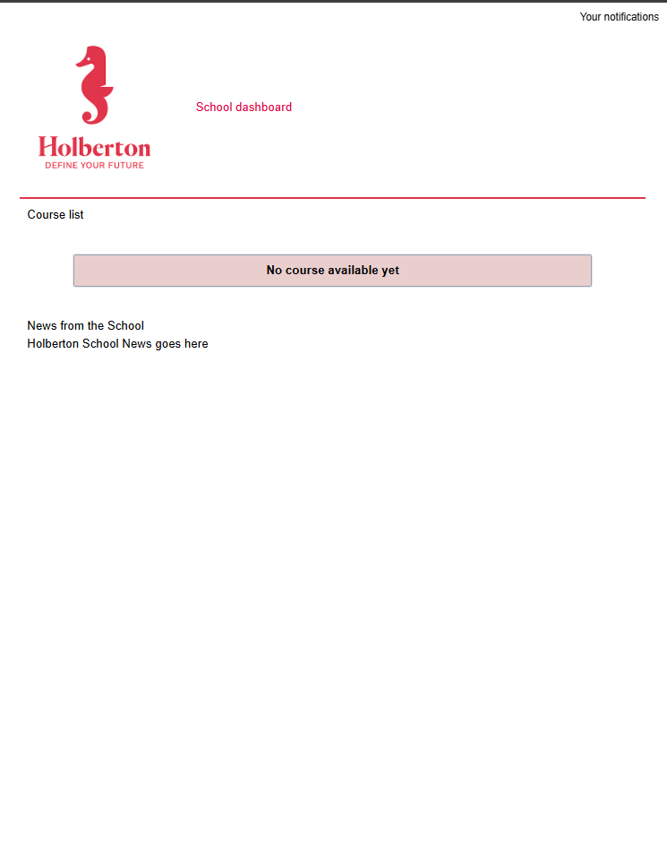
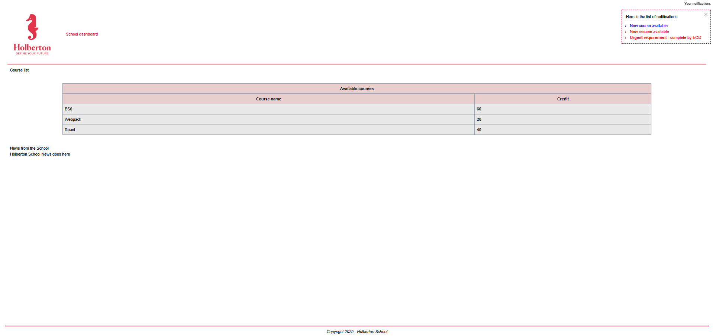
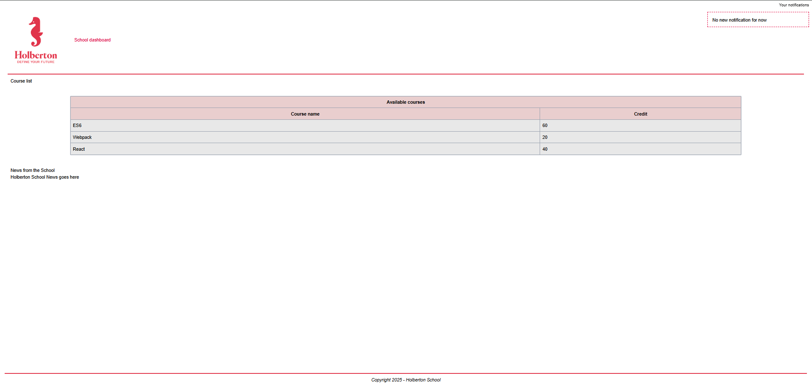
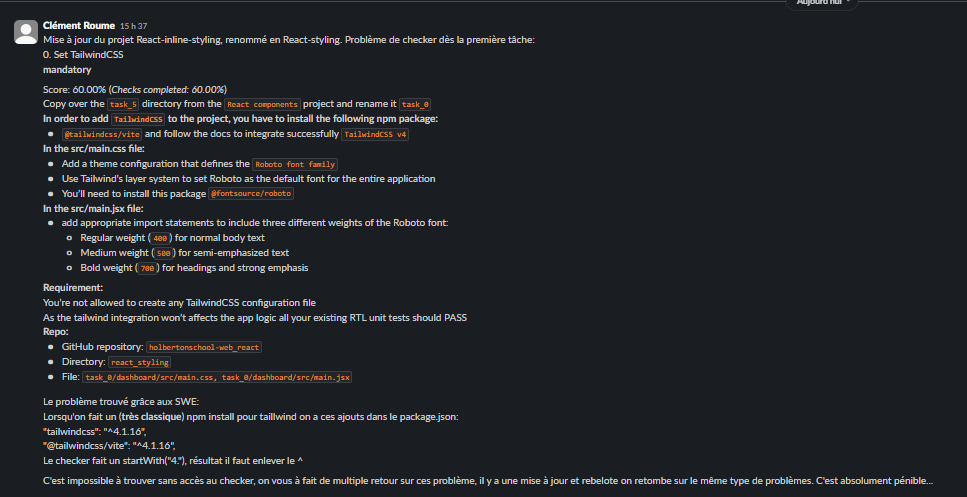

# react_component

# Task0
```bash
root@UID7E:/mnt/d/Users/steph/Documents/5ème_trimestre/holbertonschool-web_react/react_component
/task_0/dashboard# npm run build

> dashboard@0.0.0 build
> vite build

vite v5.4.20 building for production...
✓ 52 modules transformed.
dist/index.html                            0.59 kB │ gzip:  0.35 kB
dist/assets/holberton-logo-CIW0R4GT.jpg   23.64 kB
dist/assets/index-B8KTArxz.css             2.15 kB │ gzip:  0.82 kB
dist/assets/index-3z51f1gz.js            150.34 kB │ gzip: 50.19 kB
✓ built in 2.80s

> dashboard@0.0.0 postbuild
> cp dist/index.html dist/404.html || copy dist\index.html dist\404.html

root@UID7E:/mnt/d/Users/steph/Documents/5ème_trimestre/holbertonschool-web_react/react_component
/task_0/dashboard# npm run lint

> dashboard@0.0.0 lint
> eslint -c eslint.config.js "src/**/*.{js,jsx}"

root@UID7E:/mnt/d/Users/steph/Documents/5ème_trimestre/holbertonschool-web_react/react_component
/task_0/dashboard# npm run dev

> dashboard@0.0.0 dev
> vite


  VITE v5.4.20  ready in 1634 ms

  ➜  Local:   http://localhost:5173/holbertonschool-web_react/
  ➜  Network: use --host to expose
  ➜  press h + enter to show help


root@UID7E:/mnt/d/Users/steph/Documents/5ème_trimestre/holbertonschool-web_react/react_component
/task_0/dashboard# npm run test

> dashboard@0.0.0 test
> jest --watchAll=false

 PASS  src/utils/utils.spec.js (40.708 s)
 PASS  src/Notifications/NotificationItem.spec.js (52.565 s)
 PASS  src/App/App.spec.js (54.197 s)
 PASS  src/CourseList/CourseList.spec.js (56.238 s)
 PASS  src/Notifications/Notifications.spec.js (59.345 s)
  ● Console

    console.log
      Close button has been clicked

      at console.<anonymous> (node_modules/jest-mock/build/index.js:794:25)

 PASS  ./test-app-component.spec.js (56.801 s)
 PASS  src/Header/Header.spec.js (10.473 s)
 PASS  src/favicon.spec.js (6.823 s)
 PASS  src/staticAssets.spec.js (12.159 s)
 PASS  src/Login/Login.spec.js (26.58 s)
 PASS  src/Footer/Footer.spec.js (11.211 s)
 PASS  src/CourseList/CourseListRow.spec.js (79.847 s)

Test Suites: 12 passed, 12 total
Tests:       37 passed, 37 total
Snapshots:   0 total
Time:        125.322 s
Ran all test suites.

```

# Task1

```bash

```

# Task2
````bash
root@UID7E:/mnt/d/Users/steph/Documents/5ème_trimestre/holbertonschool-web_react/react_com
ponent/task_2/dashboard# npm run build

> dashboard@0.0.0 build
> vite build

vite v5.4.20 building for production...
✓ 52 modules transformed.
dist/index.html                            0.59 kB │ gzip:  0.35 kB
dist/assets/holberton-logo-CIW0R4GT.jpg   23.64 kB
dist/assets/index-B8KTArxz.css             2.15 kB │ gzip:  0.82 kB
dist/assets/index-a5hI8TA5.js            151.28 kB │ gzip: 50.49 kB
✓ built in 1.69s

> dashboard@0.0.0 postbuild
> cp dist/index.html dist/404.html || copy dist\index.html dist\404.html

root@UID7E:/mnt/d/Users/steph/Documents/5ème_trimestre/holbertonschool-web_react/react_com
ponent/task_2/dashboard# npm run test

> dashboard@0.0.0 test
> jest --watchAll=false

 PASS  src/utils/utils.spec.js (17.729 s)
 PASS  src/Login/Login.spec.js (43.174 s)
 PASS  src/CourseList/CourseList.spec.js (50.077 s)
 PASS  src/App/App.spec.js (50.527 s)
 PASS  ./test-app-component.spec.js (51.251 s)
 PASS  src/favicon.spec.js
 PASS  src/staticAssets.spec.js
 PASS  src/Footer/Footer.spec.js
 PASS  src/Notifications/NotificationItem.spec.js
 PASS  src/Header/Header.spec.js (29.43 s)
 PASS  src/Notifications/Notifications.spec.js (47.635 s)
 PASS  src/CourseList/CourseListRow.spec.js (62.54 s)

Test Suites: 12 passed, 12 total
Tests:       41 passed, 41 total
Snapshots:   0 total
Time:        83.274 s
Ran all test suites.
```

# Task3

```bash
root@UID7E:/mnt/d/Users/steph/Documents/5ème_trimestre/holbertonschool-web_react/react_com
ponent/task_3/dashboard# npm run build

> dashboard@0.0.0 build
> vite build

vite v5.4.20 building for production...
✓ 52 modules transformed.
dist/index.html                            0.59 kB │ gzip:  0.35 kB
dist/assets/holberton-logo-CIW0R4GT.jpg   23.64 kB
dist/assets/index-B8KTArxz.css             2.15 kB │ gzip:  0.82 kB
dist/assets/index-a5hI8TA5.js            151.28 kB │ gzip: 50.49 kB
✓ built in 1.47s

> dashboard@0.0.0 postbuild
> cp dist/index.html dist/404.html || copy dist\index.html dist\404.html

root@UID7E:/mnt/d/Users/steph/Documents/5ème_trimestre/holbertonschool-web_react/react_com
ponent/task_3/dashboard# npm run test

> dashboard@0.0.0 test
> jest --watchAll=false

 PASS  src/BodySection/BodySectionWithMarginBottom.spec.js (22.399 s)
 PASS  src/Notifications/Notifications.spec.js (23.043 s)
 PASS  src/utils/utils.spec.js
 PASS  src/CourseList/CourseListRow.spec.js (38.404 s)
 PASS  ./test-app-component.spec.js (28.709 s)
 PASS  src/BodySection/BodySection.spec.js
 PASS  src/Login/Login.spec.js (6.96 s)
 PASS  src/Header/Header.spec.js (6.099 s)
 PASS  src/favicon.spec.js
 PASS  src/staticAssets.spec.js (6.105 s)
 PASS  src/Footer/Footer.spec.js
 PASS  src/App/App.spec.js (38.898 s)
 PASS  src/Notifications/NotificationItem.spec.js (38.168 s)
 PASS  src/CourseList/CourseList.spec.js (40.805 s)

Test Suites: 14 passed, 14 total
Tests:       45 passed, 45 total
Snapshots:   0 total
Time:        56.344 s
Ran all test suites.
root@UID7E:/mnt/d/Users/steph/Documents/5ème_trimestre/holbertonschool-web_react/react_com
ponent/task_3/dashboard# npm run dev

> dashboard@0.0.0 dev
> vite


  VITE v5.4.20  ready in 1070 ms

  ➜  Local:   http://localhost:5173/holbertonschool-web_react/
  ➜  Network: use --host to expose
  ➜  press h + enter to show help
```

# Task4

```bash
root@UID7E:/mnt/d/Users/steph/Documents/5ème_trimestre/holbertonschool-web_react/react_com
ponent/task_3/dashboard# npm run build

> dashboard@0.0.0 build
> vite build

vite v5.4.20 building for production...
✓ 55 modules transformed.
dist/index.html                            0.59 kB │ gzip:  0.34 kB
dist/assets/holberton-logo-CIW0R4GT.jpg   23.64 kB
dist/assets/index-C-po6wFU.css             2.19 kB │ gzip:  0.84 kB
dist/assets/index-BecyewEd.js            151.83 kB │ gzip: 50.64 kB
✓ built in 1.70s

> dashboard@0.0.0 postbuild
> cp dist/index.html dist/404.html || copy dist\index.html dist\404.html

root@UID7E:/mnt/d/Users/steph/Documents/5ème_trimestre/holbertonschool-web_react/react_com
ponent/task_3/dashboard# npm run test

> dashboard@0.0.0 test
> jest --watchAll=false

 PASS  src/CourseList/CourseListRow.spec.js (87.86 s)
 PASS  src/Notifications/NotificationItem.spec.js (97.43 s)
 PASS  ./test-app-component.spec.js (101.496 s)
 PASS  src/BodySection/BodySectionWithMarginBottom.spec.js (99.914 s)
 PASS  src/Header/Header.spec.js (39.46 s)
 PASS  src/staticAssets.spec.js (30.423 s)
 PASS  src/BodySection/BodySection.spec.js (31.835 s)
 PASS  src/Notifications/Notifications.spec.js (124.886 s)
 PASS  src/App/App.spec.js (129.883 s)
 PASS  src/Login/Login.spec.js (37.915 s)
 PASS  src/utils/utils.spec.js (11.747 s)
 PASS  src/favicon.spec.js (13.102 s)
 PASS  src/Footer/Footer.spec.js (25.119 s)
 PASS  src/CourseList/CourseList.spec.js (198.338 s)

Test Suites: 14 passed, 14 total
Tests:       48 passed, 48 total
Snapshots:   0 total
Time:        248.411 s
Ran all test suites.
root@UID7E:/mnt/d/Users/steph/Documents/5ème_trimestre/holbertonschool-web_react/react_com
ponent/task_3/dashboard#

```

# Task5

```bash
root@UID7E:/mnt/d/Users/steph/Documents/5ème_trimestre/holbertonschool-web_react/react_com
ponent/task_4/dashboard# npm run build

> dashboard@0.0.0 build
> vite build

vite v5.4.20 building for production...
✓ 56 modules transformed.
dist/index.html                            0.59 kB │ gzip:  0.34 kB
dist/assets/holberton-logo-CIW0R4GT.jpg   23.64 kB
dist/assets/index-C-po6wFU.css             2.19 kB │ gzip:  0.84 kB
dist/assets/index-Bnv1_iBP.js            152.16 kB │ gzip: 50.75 kB
✓ built in 1.87s

> dashboard@0.0.0 postbuild
> cp dist/index.html dist/404.html || copy dist\index.html dist\404.html

root@UID7E:/mnt/d/Users/steph/Documents/5ème_trimestre/holbertonschool-web_react/react_com
ponent/task_4/dashboard# npm run test

> dashboard@0.0.0 test
> jest --watchAll=false

 PASS  src/Notifications/Notifications.spec.js (29.043 s)
 PASS  src/CourseList/CourseListRow.spec.js (27.897 s)
 PASS  src/Notifications/NotificationItem.spec.js (29.687 s)
 PASS  ./test-app-component.spec.js (29.402 s)
  ● Console

    console.log
      Component Login is mounted

      at WithLoggingHOC.log [as componentDidMount] (src/HOC/WithLogging.jsx:9:15)

    console.log
      Component Login is going to unmount

      at WithLoggingHOC.log [as componentWillUnmount] (src/HOC/WithLogging.jsx:13:15)
          at Array.forEach (<anonymous>)

    console.log
      Component Login is mounted

      at WithLoggingHOC.log [as componentDidMount] (src/HOC/WithLogging.jsx:9:15)

    console.log
      Component Login is going to unmount

      at WithLoggingHOC.log [as componentWillUnmount] (src/HOC/WithLogging.jsx:13:15)
          at Array.forEach (<anonymous>)

    console.log
      Component Login is mounted

      at WithLoggingHOC.log [as componentDidMount] (src/HOC/WithLogging.jsx:9:15)

    console.log
      Component Login is going to unmount

      at WithLoggingHOC.log [as componentWillUnmount] (src/HOC/WithLogging.jsx:13:15)
          at Array.forEach (<anonymous>)

 PASS  src/HOC/WithLogging.spec.js (39.827 s)
  ● Console

    console.log
      Component MockApp is mounted

      at WithLoggingHOC.log [as componentDidMount] (src/HOC/WithLogging.jsx:9:15)

    console.log
      Component MockApp is going to unmount

      at WithLoggingHOC.log [as componentWillUnmount] (src/HOC/WithLogging.jsx:13:15)
          at Array.forEach (<anonymous>)

 PASS  src/BodySection/BodySectionWithMarginBottom.spec.js (29.278 s)
 PASS  src/utils/utils.spec.js
 PASS  src/CourseList/CourseList.spec.js (6.865 s)
  ● Console

    console.log
      Component CourseList is mounted

      at WithLoggingHOC.log [as componentDidMount] (src/HOC/WithLogging.jsx:9:15)

    console.log
      Component CourseList is going to unmount

      at WithLoggingHOC.log [as componentWillUnmount] (src/HOC/WithLogging.jsx:13:15)
          at Array.forEach (<anonymous>)

    console.log
      Component CourseList is mounted

      at WithLoggingHOC.log [as componentDidMount] (src/HOC/WithLogging.jsx:9:15)

    console.log
      Component CourseList is going to unmount

      at WithLoggingHOC.log [as componentWillUnmount] (src/HOC/WithLogging.jsx:13:15)
          at Array.forEach (<anonymous>)

 PASS  src/BodySection/BodySection.spec.js (6.636 s)
 PASS  src/favicon.spec.js
 PASS  src/Login/Login.spec.js (8.285 s)
  ● Console

    console.log
      Component Login is mounted

      at WithLoggingHOC.log [as componentDidMount] (src/HOC/WithLogging.jsx:9:15)

    console.log
      Component Login is going to unmount

      at WithLoggingHOC.log [as componentWillUnmount] (src/HOC/WithLogging.jsx:13:15)
          at Array.forEach (<anonymous>)

    console.log
      Component Login is mounted

      at WithLoggingHOC.log [as componentDidMount] (src/HOC/WithLogging.jsx:9:15)

    console.log
      Component Login is going to unmount

      at WithLoggingHOC.log [as componentWillUnmount] (src/HOC/WithLogging.jsx:13:15)
          at Array.forEach (<anonymous>)

    console.log
      Component Login is mounted

      at WithLoggingHOC.log [as componentDidMount] (src/HOC/WithLogging.jsx:9:15)

    console.log
      Component Login is going to unmount

      at WithLoggingHOC.log [as componentWillUnmount] (src/HOC/WithLogging.jsx:13:15)
          at Array.forEach (<anonymous>)

 PASS  src/Header/Header.spec.js
 PASS  src/staticAssets.spec.js (6.463 s)
 PASS  src/Footer/Footer.spec.js (6.783 s)
 PASS  src/App/App.spec.js (52.04 s)
  ● Console

    console.log
      Component Login is mounted

      at WithLoggingHOC.log [as componentDidMount] (src/HOC/WithLogging.jsx:9:15)

    console.log
      Component Login is going to unmount

      at WithLoggingHOC.log [as componentWillUnmount] (src/HOC/WithLogging.jsx:13:15)
          at Array.forEach (<anonymous>)

    console.log
      Component Login is mounted

      at WithLoggingHOC.log [as componentDidMount] (src/HOC/WithLogging.jsx:9:15)

    console.log
      Component Login is going to unmount

      at WithLoggingHOC.log [as componentWillUnmount] (src/HOC/WithLogging.jsx:13:15)
          at Array.forEach (<anonymous>)

    console.log
      Component Login is mounted

      at WithLoggingHOC.log [as componentDidMount] (src/HOC/WithLogging.jsx:9:15)

    console.log
      Component Login is going to unmount

      at WithLoggingHOC.log [as componentWillUnmount] (src/HOC/WithLogging.jsx:13:15)
          at Array.forEach (<anonymous>)

    console.log
      Component Login is mounted

      at WithLoggingHOC.log [as componentDidMount] (src/HOC/WithLogging.jsx:9:15)

    console.log
      Component Login is going to unmount

      at WithLoggingHOC.log [as componentWillUnmount] (src/HOC/WithLogging.jsx:13:15)
          at Array.forEach (<anonymous>)

    console.log
      Component CourseList is mounted

      at WithLoggingHOC.log [as componentDidMount] (src/HOC/WithLogging.jsx:9:15)

    console.log
      Component CourseList is going to unmount

      at WithLoggingHOC.log [as componentWillUnmount] (src/HOC/WithLogging.jsx:13:15)
          at Array.forEach (<anonymous>)

    console.log
      Component Login is mounted

      at WithLoggingHOC.log [as componentDidMount] (src/HOC/WithLogging.jsx:9:15)

    console.log
      Component Login is going to unmount

      at WithLoggingHOC.log [as componentWillUnmount] (src/HOC/WithLogging.jsx:13:15)
          at Array.forEach (<anonymous>)

    console.log
      Component Login is mounted

      at WithLoggingHOC.log [as componentDidMount] (src/HOC/WithLogging.jsx:9:15)

    console.log
      Component Login is going to unmount

      at WithLoggingHOC.log [as componentWillUnmount] (src/HOC/WithLogging.jsx:13:15)
          at Array.forEach (<anonymous>)

    console.log
      Component Login is mounted

      at WithLoggingHOC.log [as componentDidMount] (src/HOC/WithLogging.jsx:9:15)

    console.log
      Component Login is going to unmount

      at WithLoggingHOC.log [as componentWillUnmount] (src/HOC/WithLogging.jsx:13:15)
          at Array.forEach (<anonymous>)

    console.log
      Component CourseList is mounted

      at WithLoggingHOC.log [as componentDidMount] (src/HOC/WithLogging.jsx:9:15)

    console.log
      Component CourseList is going to unmount

      at WithLoggingHOC.log [as componentWillUnmount] (src/HOC/WithLogging.jsx:13:15)
          at Array.forEach (<anonymous>)

    console.log
      Component Login is mounted

      at WithLoggingHOC.log [as componentDidMount] (src/HOC/WithLogging.jsx:9:15)

    console.log
      Component Login is going to unmount

      at WithLoggingHOC.log [as componentWillUnmount] (src/HOC/WithLogging.jsx:13:15)
          at Array.forEach (<anonymous>)


Test Suites: 15 passed, 15 total
Tests:       51 passed, 51 total
Snapshots:   0 total
Time:        71.104 s
Ran all test suites.

root@UID7E:/mnt/d/Users/steph/Documents/5ème_trimestre/holbertonschool-web_react/react_com
ponent/task_4/dashboard# npm run dev

> dashboard@0.0.0 dev
> vite

Re-optimizing dependencies because vite config has changed

  VITE v5.4.20  ready in 2210 ms

  ➜  Local:   http://localhost:5173/holbertonschool-web_react/
  ➜  Network: use --host to expose
  ➜  press h + enter to show help

```

# Task6

```bash
root@UID7E:/mnt/d/Users/steph/Documents/5ème_trimestre/holbertonschool-web_react/react_com
ponent/task_5/dashboard# npm run build

> dashboard@0.0.0 build
> vite build

vite v5.4.20 building for production...
✓ 56 modules transformed.
dist/index.html                            0.59 kB │ gzip:  0.35 kB
dist/assets/holberton-logo-CIW0R4GT.jpg   23.64 kB
dist/assets/index-C-po6wFU.css             2.19 kB │ gzip:  0.84 kB
dist/assets/index-o1zSYQAC.js            152.17 kB │ gzip: 50.76 kB
✓ built in 1.59s

> dashboard@0.0.0 postbuild
> cp dist/index.html dist/404.html || copy dist\index.html dist\404.html

root@UID7E:/mnt/d/Users/steph/Documents/5ème_trimestre/holbertonschool-web_react/react_com
ponent/task_5/dashboard# npm run test

> dashboard@0.0.0 test
> jest --watchAll=false

 PASS  src/CourseList/CourseListRow.spec.js (20.248 s)
 PASS  src/App/App.spec.js (22.925 s)
  ● Console

    console.log
      Component Login is mounted

      at WithLoggingHOC.log [as componentDidMount] (src/HOC/WithLogging.jsx:9:15)

    console.log
      Component Login is going to unmount

      at WithLoggingHOC.log [as componentWillUnmount] (src/HOC/WithLogging.jsx:13:15)
          at Array.forEach (<anonymous>)

    console.log
      Component Login is mounted

      at WithLoggingHOC.log [as componentDidMount] (src/HOC/WithLogging.jsx:9:15)

    console.log
      Component Login is going to unmount

      at WithLoggingHOC.log [as componentWillUnmount] (src/HOC/WithLogging.jsx:13:15)
          at Array.forEach (<anonymous>)

    console.log
      Component Login is mounted

      at WithLoggingHOC.log [as componentDidMount] (src/HOC/WithLogging.jsx:9:15)

    console.log
      Component Login is going to unmount

      at WithLoggingHOC.log [as componentWillUnmount] (src/HOC/WithLogging.jsx:13:15)
          at Array.forEach (<anonymous>)

    console.log
      Component Login is mounted

      at WithLoggingHOC.log [as componentDidMount] (src/HOC/WithLogging.jsx:9:15)

    console.log
      Component Login is going to unmount

      at WithLoggingHOC.log [as componentWillUnmount] (src/HOC/WithLogging.jsx:13:15)
          at Array.forEach (<anonymous>)

    console.log
      Component CourseList is mounted

      at WithLoggingHOC.log [as componentDidMount] (src/HOC/WithLogging.jsx:9:15)

    console.log
      Component CourseList is going to unmount

      at WithLoggingHOC.log [as componentWillUnmount] (src/HOC/WithLogging.jsx:13:15)
          at Array.forEach (<anonymous>)

    console.log
      Component Login is mounted

      at WithLoggingHOC.log [as componentDidMount] (src/HOC/WithLogging.jsx:9:15)

    console.log
      Component Login is going to unmount

      at WithLoggingHOC.log [as componentWillUnmount] (src/HOC/WithLogging.jsx:13:15)
          at Array.forEach (<anonymous>)

    console.log
      Component Login is mounted

      at WithLoggingHOC.log [as componentDidMount] (src/HOC/WithLogging.jsx:9:15)

    console.log
      Component Login is going to unmount

      at WithLoggingHOC.log [as componentWillUnmount] (src/HOC/WithLogging.jsx:13:15)
          at Array.forEach (<anonymous>)

    console.log
      Component Login is mounted

      at WithLoggingHOC.log [as componentDidMount] (src/HOC/WithLogging.jsx:9:15)

    console.log
      Component Login is going to unmount

      at WithLoggingHOC.log [as componentWillUnmount] (src/HOC/WithLogging.jsx:13:15)
          at Array.forEach (<anonymous>)

    console.log
      Component CourseList is mounted

      at WithLoggingHOC.log [as componentDidMount] (src/HOC/WithLogging.jsx:9:15)

    console.log
      Component CourseList is going to unmount

      at WithLoggingHOC.log [as componentWillUnmount] (src/HOC/WithLogging.jsx:13:15)
          at Array.forEach (<anonymous>)

    console.log
      Component Login is mounted

      at WithLoggingHOC.log [as componentDidMount] (src/HOC/WithLogging.jsx:9:15)

    console.log
      Component Login is going to unmount

      at WithLoggingHOC.log [as componentWillUnmount] (src/HOC/WithLogging.jsx:13:15)
          at Array.forEach (<anonymous>)

 PASS  src/Notifications/NotificationItem.spec.js (23.041 s)
 PASS  ./test-app-component.spec.js (24.122 s)
  ● Console

    console.log
      Component Login is mounted

      at WithLoggingHOC.log [as componentDidMount] (src/HOC/WithLogging.jsx:9:15)

    console.log
      Component Login is going to unmount

      at WithLoggingHOC.log [as componentWillUnmount] (src/HOC/WithLogging.jsx:13:15)
          at Array.forEach (<anonymous>)

    console.log
      Component Login is mounted

      at WithLoggingHOC.log [as componentDidMount] (src/HOC/WithLogging.jsx:9:15)

    console.log
      Component Login is going to unmount

      at WithLoggingHOC.log [as componentWillUnmount] (src/HOC/WithLogging.jsx:13:15)
          at Array.forEach (<anonymous>)

    console.log
      Component Login is mounted

      at WithLoggingHOC.log [as componentDidMount] (src/HOC/WithLogging.jsx:9:15)

    console.log
      Component Login is going to unmount

      at WithLoggingHOC.log [as componentWillUnmount] (src/HOC/WithLogging.jsx:13:15)
          at Array.forEach (<anonymous>)

 PASS  src/HOC/WithLogging.spec.js (26.032 s)
  ● Console

    console.log
      Component MockApp is mounted

      at WithLoggingHOC.log [as componentDidMount] (src/HOC/WithLogging.jsx:9:15)

    console.log
      Component MockApp is going to unmount

      at WithLoggingHOC.log [as componentWillUnmount] (src/HOC/WithLogging.jsx:13:15)
          at Array.forEach (<anonymous>)

 PASS  src/utils/utils.spec.js
 PASS  src/Notifications/Notifications.spec.js (25.933 s)
 PASS  src/CourseList/CourseList.spec.js (9.394 s)
  ● Console

    console.log
      Component CourseList is mounted

      at WithLoggingHOC.log [as componentDidMount] (src/HOC/WithLogging.jsx:9:15)

    console.log
      Component CourseList is going to unmount

      at WithLoggingHOC.log [as componentWillUnmount] (src/HOC/WithLogging.jsx:13:15)
          at Array.forEach (<anonymous>)

    console.log
      Component CourseList is mounted

      at WithLoggingHOC.log [as componentDidMount] (src/HOC/WithLogging.jsx:9:15)

    console.log
      Component CourseList is going to unmount

      at WithLoggingHOC.log [as componentWillUnmount] (src/HOC/WithLogging.jsx:13:15)
          at Array.forEach (<anonymous>)

 PASS  src/BodySection/BodySection.spec.js (8.657 s)
 PASS  src/favicon.spec.js
 PASS  src/Login/Login.spec.js (8.085 s)
  ● Console

    console.log
      Component Login is mounted

      at WithLoggingHOC.log [as componentDidMount] (src/HOC/WithLogging.jsx:9:15)

    console.log
      Component Login is going to unmount

      at WithLoggingHOC.log [as componentWillUnmount] (src/HOC/WithLogging.jsx:13:15)
          at Array.forEach (<anonymous>)

    console.log
      Component Login is mounted

      at WithLoggingHOC.log [as componentDidMount] (src/HOC/WithLogging.jsx:9:15)

    console.log
      Component Login is going to unmount

      at WithLoggingHOC.log [as componentWillUnmount] (src/HOC/WithLogging.jsx:13:15)
          at Array.forEach (<anonymous>)

    console.log
      Component Login is mounted

      at WithLoggingHOC.log [as componentDidMount] (src/HOC/WithLogging.jsx:9:15)

    console.log
      Component Login is going to unmount

      at WithLoggingHOC.log [as componentWillUnmount] (src/HOC/WithLogging.jsx:13:15)
          at Array.forEach (<anonymous>)

 PASS  src/staticAssets.spec.js (5.774 s)
 PASS  src/Header/Header.spec.js (5.957 s)
 PASS  src/Footer/Footer.spec.js (7.888 s)
 PASS  src/BodySection/BodySectionWithMarginBottom.spec.js (46.598 s)

Test Suites: 15 passed, 15 total
Tests:       51 passed, 51 total
Snapshots:   0 total
Time:        60.384 s
Ran all test suites.
root@UID7E:/mnt/d/Users/steph/Documents/5ème_trimestre/holbertonschool-web_react/react_com
ponent/task_5/dashboard# npm run dev

> dashboard@0.0.0 dev
> vite

Re-optimizing dependencies because vite config has changed

  VITE v5.4.20  ready in 1231 ms

  ➜  Local:   http://localhost:5173/holbertonschool-web_react/
  ➜  Network: use --host to expose
  ➜  press h + enter to show help

```

# Task7

```bash
root@UID7E:/mnt/d/Users/steph/Documents/5ème_trimestre/holbertonschool-web_react/react_com
ponent/task_5/dashboard# npm run build

> dashboard@0.0.0 build
> vite build

vite v5.4.20 building for production...
✓ 56 modules transformed.
dist/index.html                            0.59 kB │ gzip:  0.35 kB
dist/assets/holberton-logo-CIW0R4GT.jpg   23.64 kB
dist/assets/index-C-po6wFU.css             2.19 kB │ gzip:  0.84 kB
dist/assets/index-D1gLy7R9.js            152.25 kB │ gzip: 50.79 kB
✓ built in 2.11s

> dashboard@0.0.0 postbuild
> cp dist/index.html dist/404.html || copy dist\index.html dist\404.html

root@UID7E:/mnt/d/Users/steph/Documents/5ème_trimestre/holbertonschool-web_react/react_com
ponent/task_5/dashboard# npm run test

> dashboard@0.0.0 test
> jest --watchAll=false

 PASS  src/CourseList/CourseListRow.spec.js (18.049 s)
 PASS  src/HOC/WithLogging.spec.js (18.19 s)
  ● Console

    console.log
      Component MockApp is mounted

      at WithLoggingHOC.log [as componentDidMount] (src/HOC/WithLogging.jsx:9:15)

    console.log
      Component MockApp is going to unmount

      at WithLoggingHOC.log [as componentWillUnmount] (src/HOC/WithLogging.jsx:13:15)
          at Array.forEach (<anonymous>)

 PASS  src/Notifications/NotificationItem.spec.js (24.369 s)
 PASS  src/CourseList/CourseList.spec.js (7.034 s)
  ● Console

    console.log
      Component CourseList is mounted

      at WithLoggingHOC.log [as componentDidMount] (src/HOC/WithLogging.jsx:9:15)

    console.log
      Component CourseList is going to unmount

      at WithLoggingHOC.log [as componentWillUnmount] (src/HOC/WithLogging.jsx:13:15)
          at Array.forEach (<anonymous>)

    console.log
      Component CourseList is mounted

      at WithLoggingHOC.log [as componentDidMount] (src/HOC/WithLogging.jsx:9:15)

    console.log
      Component CourseList is going to unmount

      at WithLoggingHOC.log [as componentWillUnmount] (src/HOC/WithLogging.jsx:13:15)
          at Array.forEach (<anonymous>)

 PASS  src/BodySection/BodySection.spec.js
 PASS  src/Notifications/Notifications.spec.js (15.764 s)
 PASS  src/Footer/Footer.spec.js
 PASS  src/Login/Login.spec.js
  ● Console

    console.log
      Component Login is mounted

      at WithLoggingHOC.log [as componentDidMount] (src/HOC/WithLogging.jsx:9:15)

    console.log
      Component Login is going to unmount

      at WithLoggingHOC.log [as componentWillUnmount] (src/HOC/WithLogging.jsx:13:15)
          at Array.forEach (<anonymous>)

    console.log
      Component Login is mounted

      at WithLoggingHOC.log [as componentDidMount] (src/HOC/WithLogging.jsx:9:15)

    console.log
      Component Login is going to unmount

      at WithLoggingHOC.log [as componentWillUnmount] (src/HOC/WithLogging.jsx:13:15)
          at Array.forEach (<anonymous>)

    console.log
      Component Login is mounted

      at WithLoggingHOC.log [as componentDidMount] (src/HOC/WithLogging.jsx:9:15)

    console.log
      Component Login is going to unmount

      at WithLoggingHOC.log [as componentWillUnmount] (src/HOC/WithLogging.jsx:13:15)
          at Array.forEach (<anonymous>)

 PASS  src/Header/Header.spec.js (6.905 s)
 PASS  src/favicon.spec.js
 PASS  src/utils/utils.spec.js
 PASS  src/staticAssets.spec.js (6.447 s)
 PASS  src/BodySection/BodySectionWithMarginBottom.spec.js (20.695 s)
 PASS  ./test-app-component.spec.js (20.439 s)
  ● Console

    console.log
      Component Login is mounted

      at WithLoggingHOC.log [as componentDidMount] (src/HOC/WithLogging.jsx:9:15)

    console.log
      Component Login is going to unmount

      at WithLoggingHOC.log [as componentWillUnmount] (src/HOC/WithLogging.jsx:13:15)
          at Array.forEach (<anonymous>)

    console.log
      Component Login is mounted

      at WithLoggingHOC.log [as componentDidMount] (src/HOC/WithLogging.jsx:9:15)

    console.log
      Component Login is going to unmount

      at WithLoggingHOC.log [as componentWillUnmount] (src/HOC/WithLogging.jsx:13:15)
          at Array.forEach (<anonymous>)

    console.log
      Component Login is mounted

      at WithLoggingHOC.log [as componentDidMount] (src/HOC/WithLogging.jsx:9:15)

    console.log
      Component Login is going to unmount

      at WithLoggingHOC.log [as componentWillUnmount] (src/HOC/WithLogging.jsx:13:15)
          at Array.forEach (<anonymous>)

 PASS  src/App/App.spec.js (32.557 s)
  ● Console

    console.log
      Component Login is mounted

      at WithLoggingHOC.log [as componentDidMount] (src/HOC/WithLogging.jsx:9:15)

    console.log
      Component Login is going to unmount

      at WithLoggingHOC.log [as componentWillUnmount] (src/HOC/WithLogging.jsx:13:15)
          at Array.forEach (<anonymous>)

    console.log
      Component Login is mounted

      at WithLoggingHOC.log [as componentDidMount] (src/HOC/WithLogging.jsx:9:15)

    console.log
      Component Login is going to unmount

      at WithLoggingHOC.log [as componentWillUnmount] (src/HOC/WithLogging.jsx:13:15)
          at Array.forEach (<anonymous>)

    console.log
      Component Login is mounted

      at WithLoggingHOC.log [as componentDidMount] (src/HOC/WithLogging.jsx:9:15)

    console.log
      Component Login is going to unmount

      at WithLoggingHOC.log [as componentWillUnmount] (src/HOC/WithLogging.jsx:13:15)
          at Array.forEach (<anonymous>)

    console.log
      Component Login is mounted

      at WithLoggingHOC.log [as componentDidMount] (src/HOC/WithLogging.jsx:9:15)

    console.log
      Component Login is going to unmount

      at WithLoggingHOC.log [as componentWillUnmount] (src/HOC/WithLogging.jsx:13:15)
          at Array.forEach (<anonymous>)

    console.log
      Component CourseList is mounted

      at WithLoggingHOC.log [as componentDidMount] (src/HOC/WithLogging.jsx:9:15)

    console.log
      Component CourseList is going to unmount

      at WithLoggingHOC.log [as componentWillUnmount] (src/HOC/WithLogging.jsx:13:15)
          at Array.forEach (<anonymous>)

    console.log
      Component Login is mounted

      at WithLoggingHOC.log [as componentDidMount] (src/HOC/WithLogging.jsx:9:15)

    console.log
      Component Login is going to unmount

      at WithLoggingHOC.log [as componentWillUnmount] (src/HOC/WithLogging.jsx:13:15)
          at Array.forEach (<anonymous>)

    console.log
      Component Login is mounted

      at WithLoggingHOC.log [as componentDidMount] (src/HOC/WithLogging.jsx:9:15)

    console.log
      Component Login is going to unmount

      at WithLoggingHOC.log [as componentWillUnmount] (src/HOC/WithLogging.jsx:13:15)
          at Array.forEach (<anonymous>)

    console.log
      Component Login is mounted

      at WithLoggingHOC.log [as componentDidMount] (src/HOC/WithLogging.jsx:9:15)

    console.log
      Component Login is going to unmount

      at WithLoggingHOC.log [as componentWillUnmount] (src/HOC/WithLogging.jsx:13:15)
          at Array.forEach (<anonymous>)

    console.log
      Component CourseList is mounted

      at WithLoggingHOC.log [as componentDidMount] (src/HOC/WithLogging.jsx:9:15)

    console.log
      Component CourseList is going to unmount

      at WithLoggingHOC.log [as componentWillUnmount] (src/HOC/WithLogging.jsx:13:15)
          at Array.forEach (<anonymous>)

    console.log
      Component Login is mounted

      at WithLoggingHOC.log [as componentDidMount] (src/HOC/WithLogging.jsx:9:15)

    console.log
      Component Login is going to unmount

      at WithLoggingHOC.log [as componentWillUnmount] (src/HOC/WithLogging.jsx:13:15)
          at Array.forEach (<anonymous>)


Test Suites: 15 passed, 15 total
Tests:       53 passed, 53 total
Snapshots:   0 total
Time:        47.674 s
Ran all test suites.
root@UID7E:/mnt/d/Users/steph/Documents/5ème_trimestre/holbertonschool-web_react/react_com
ponent/task_5/dashboard# npm run dev

> dashboard@0.0.0 dev
> vite


  VITE v5.4.20  ready in 1527 ms

  ➜  Local:   http://localhost:5173/holbertonschool-web_react/
  ➜  Network: use --host to expose
  ➜  press h + enter to show help
```


# Project react_styling

## Task 0

```bash
root@UID7E:/mnt/d/Users/steph/Documents/5ème_trimestre/holbertonschool-web_react/react_styling/tas
k_0/dashboard# npm install -g jest
npm warn deprecated inflight@1.0.6: This module is not supported, and leaks memory. Do not use it. Check out lru-cache if you want a good and tested way to coalesce async requests by a key value, which is much more comprehensive and powerful.
npm warn deprecated glob@7.2.3: Glob versions prior to v9 are no longer supported

added 298 packages in 23s

44 packages are looking for funding
  run `npm fund` for details
npm notice
npm notice New major version of npm available! 10.9.2 -> 11.6.2
npm notice Changelog: https://github.com/npm/cli/releases/tag/v11.6.2
npm notice To update run: npm install -g npm@11.6.2
npm notice
root@UID7E:/mnt/d/Users/steph/Documents/5ème_trimestre/holbertonschool-web_react/react_styling/tas
k_0/dashboard#
```

```bash
root@UID7E:/mnt/d/Users/steph/Documents/5ème_trimestre/holbertonschool-web_react/react_styling/tas
k_0/dashboard# npm i -D @tailwindcss/vite
npm i @fontsource/roboto

added 12 packages, and audited 613 packages in 11s

91 packages are looking for funding
  run `npm fund` for details

2 moderate severity vulnerabilities

To address all issues, run:
  npm audit fix

Run `npm audit` for details.

added 3 packages, and audited 616 packages in 8s

93 packages are looking for funding
  run `npm fund` for details

2 moderate severity vulnerabilities

To address all issues, run:
  npm audit fix

Run `npm audit` for details.
root@UID7E:/mnt/d/Users/steph/Documents/5ème_trimestre/holbertonschool-web_react/react_styling/tas
k_0/dashboard# npm run build

> dashboard@0.0.0 build
> vite build

vite v5.4.20 building for production...
✓ 60 modules transformed.
dist/index.html                                              0.59 kB │ gzip:  0.35 kB
dist/assets/roboto-vietnamese-400-normal-BYP5tVVv.woff       5.44 kB
dist/assets/roboto-vietnamese-700-normal-BhieYfot.woff       5.44 kB
dist/assets/roboto-vietnamese-500-normal-CUzdRVXb.woff       5.48 kB
dist/assets/roboto-greek-400-normal-DwVopRQH.woff            7.47 kB
dist/assets/roboto-greek-700-normal-Bi9oTykh.woff            7.48 kB
dist/assets/roboto-greek-500-normal-B0wzjI_J.woff            7.51 kB
dist/assets/roboto-vietnamese-500-normal-HYpufUYk.woff2      7.84 kB
dist/assets/roboto-vietnamese-400-normal-CDDxGrUb.woff2      7.86 kB
dist/assets/roboto-vietnamese-700-normal-iKxYNAzq.woff2      7.88 kB
dist/assets/roboto-symbols-500-normal-B3xPS0M7.woff          8.64 kB
dist/assets/roboto-symbols-400-normal-B2LMqLB2.woff          8.66 kB
dist/assets/roboto-symbols-700-normal-BT-mnhPp.woff          8.68 kB
dist/assets/roboto-greek-500-normal-BJMS0heP.woff2           9.64 kB
dist/assets/roboto-greek-400-normal-jFM2czAU.woff2           9.64 kB
dist/assets/roboto-greek-700-normal-BcGn9doz.woff2           9.67 kB
dist/assets/roboto-cyrillic-400-normal-C5q4FMUG.woff         9.73 kB
dist/assets/roboto-cyrillic-700-normal-bDW9bgt5.woff         9.90 kB
dist/assets/roboto-cyrillic-500-normal-DhPqGoNQ.woff         9.90 kB
dist/assets/roboto-symbols-400-normal-fF1SLJBj.woff2        10.58 kB
dist/assets/roboto-symbols-500-normal-BXFTxrNR.woff2        10.73 kB
dist/assets/roboto-symbols-700-normal-rJi6RjIy.woff2        10.86 kB
dist/assets/roboto-cyrillic-400-normal-DAIM1_dR.woff2       11.84 kB
dist/assets/roboto-cyrillic-700-normal-BiSG5NnW.woff2       11.94 kB
dist/assets/roboto-cyrillic-500-normal-hCeO1jFL.woff2       11.98 kB
dist/assets/roboto-latin-ext-400-normal-BG57dRWO.woff       12.47 kB
dist/assets/roboto-latin-ext-700-normal-B3Q5yJJO.woff       12.48 kB
dist/assets/roboto-latin-ext-500-normal-EUd9mLnZ.woff       12.52 kB
dist/assets/roboto-latin-ext-400-normal-ZYmyxeOy.woff2      13.74 kB
dist/assets/roboto-latin-ext-500-normal-C_ARlJGk.woff2      13.98 kB
dist/assets/roboto-latin-ext-700-normal-70GS1MYH.woff2      14.02 kB
dist/assets/roboto-cyrillic-ext-400-normal-5IDvadIC.woff    15.40 kB
dist/assets/roboto-cyrillic-ext-700-normal-Ct5_lukf.woff    15.52 kB
dist/assets/roboto-cyrillic-ext-500-normal-aAFKCR76.woff    15.52 kB
dist/assets/roboto-cyrillic-ext-400-normal-DzMWdK87.woff2   16.85 kB
dist/assets/roboto-cyrillic-ext-500-normal-B7rQpwPu.woff2   17.16 kB
dist/assets/roboto-cyrillic-ext-700-normal-UFn0vR9r.woff2   17.21 kB
dist/assets/roboto-math-400-normal-BRMeFL5Z.woff            18.28 kB
dist/assets/roboto-math-500-normal-nGmytUgK.woff            18.36 kB
dist/assets/roboto-math-700-normal-De_Mfcv-.woff            18.43 kB
dist/assets/roboto-latin-400-normal-BX2H0A0_.woff           19.57 kB
dist/assets/roboto-math-400-normal-B3wgz80t.woff2           19.66 kB
dist/assets/roboto-latin-500-normal-CoDN7ZW2.woff           19.67 kB
dist/assets/roboto-latin-700-normal-DxC3k-1u.woff           19.72 kB
dist/assets/roboto-math-700-normal-VUAI6Bz2.woff2           19.95 kB
dist/assets/roboto-math-500-normal-CFNaIMFC.woff2           19.98 kB
dist/assets/roboto-latin-400-normal-CNwBRw8h.woff2          20.61 kB
dist/assets/roboto-latin-500-normal-CkrA1NAy.woff2          20.93 kB
dist/assets/roboto-latin-700-normal-CXeAXeti.woff2          21.00 kB
dist/assets/holberton-logo-CIW0R4GT.jpg                     23.64 kB
dist/assets/index-D6bbFSdR.css                              46.34 kB │ gzip: 20.08 kB
dist/assets/index-CjmkVxHV.js                              152.25 kB │ gzip: 50.79 kB
✓ built in 2.94s

> dashboard@0.0.0 postbuild
> cp dist/index.html dist/404.html || copy dist\index.html dist\404.html

root@UID7E:/mnt/d/Users/steph/Documents/5ème_trimestre/holbertonschool-web_react/react_styling/tas
k_0/dashboard# npm run dev

> dashboard@0.0.0 dev
> vite

Re-optimizing dependencies because lockfile has changed

  VITE v5.4.20  ready in 2025 ms

  ➜  Local:   http://localhost:5173/holbertonschool-web_react/
  ➜  Network: use --host to expose
  ➜  press h + enter to show help
o

root@UID7E:/mnt/d/Users/steph/Documents/5ème_trimestre/holbertonschool-web_react/react_styling/tas
k_0/dashboard# npm run test

> dashboard@0.0.0 test
> jest --watchAll=false

 PASS  src/HOC/WithLogging.spec.js (14.538 s)
  ● Console

    console.log
      Component MockApp is mounted

      at WithLoggingHOC.log [as componentDidMount] (src/HOC/WithLogging.jsx:9:15)

    console.log
      Component MockApp is going to unmount

      at WithLoggingHOC.log [as componentWillUnmount] (src/HOC/WithLogging.jsx:13:15)
          at Array.forEach (<anonymous>)

 PASS  src/Notifications/NotificationItem.spec.js (14.872 s)
 PASS  src/Notifications/Notifications.spec.js (15.29 s)
 PASS  ./test-app-component.spec.js (16.16 s)
  ● Console

    console.log
      Component Login is mounted

      at WithLoggingHOC.log [as componentDidMount] (src/HOC/WithLogging.jsx:9:15)

    console.log
      Component Login is going to unmount

      at WithLoggingHOC.log [as componentWillUnmount] (src/HOC/WithLogging.jsx:13:15)
          at Array.forEach (<anonymous>)

    console.log
      Component Login is mounted

      at WithLoggingHOC.log [as componentDidMount] (src/HOC/WithLogging.jsx:9:15)

    console.log
      Component Login is going to unmount

      at WithLoggingHOC.log [as componentWillUnmount] (src/HOC/WithLogging.jsx:13:15)
          at Array.forEach (<anonymous>)

    console.log
      Component Login is mounted

      at WithLoggingHOC.log [as componentDidMount] (src/HOC/WithLogging.jsx:9:15)

    console.log
      Component Login is going to unmount

      at WithLoggingHOC.log [as componentWillUnmount] (src/HOC/WithLogging.jsx:13:15)
          at Array.forEach (<anonymous>)

 PASS  src/Footer/Footer.spec.js
 PASS  src/CourseList/CourseList.spec.js
  ● Console

    console.log
      Component CourseList is mounted

      at WithLoggingHOC.log [as componentDidMount] (src/HOC/WithLogging.jsx:9:15)

    console.log
      Component CourseList is going to unmount

      at WithLoggingHOC.log [as componentWillUnmount] (src/HOC/WithLogging.jsx:13:15)
          at Array.forEach (<anonymous>)

    console.log
      Component CourseList is mounted

      at WithLoggingHOC.log [as componentDidMount] (src/HOC/WithLogging.jsx:9:15)

    console.log
      Component CourseList is going to unmount

      at WithLoggingHOC.log [as componentWillUnmount] (src/HOC/WithLogging.jsx:13:15)
          at Array.forEach (<anonymous>)

 PASS  src/Login/Login.spec.js (5.627 s)
  ● Console

    console.log
      Component Login is mounted

      at WithLoggingHOC.log [as componentDidMount] (src/HOC/WithLogging.jsx:9:15)

    console.log
      Component Login is going to unmount

      at WithLoggingHOC.log [as componentWillUnmount] (src/HOC/WithLogging.jsx:13:15)
          at Array.forEach (<anonymous>)

    console.log
      Component Login is mounted

      at WithLoggingHOC.log [as componentDidMount] (src/HOC/WithLogging.jsx:9:15)

    console.log
      Component Login is going to unmount

      at WithLoggingHOC.log [as componentWillUnmount] (src/HOC/WithLogging.jsx:13:15)
          at Array.forEach (<anonymous>)

    console.log
      Component Login is mounted

      at WithLoggingHOC.log [as componentDidMount] (src/HOC/WithLogging.jsx:9:15)

    console.log
      Component Login is going to unmount

      at WithLoggingHOC.log [as componentWillUnmount] (src/HOC/WithLogging.jsx:13:15)
          at Array.forEach (<anonymous>)

 PASS  src/CourseList/CourseListRow.spec.js (21.041 s)
 PASS  src/utils/utils.spec.js
 PASS  src/App/App.spec.js (22.796 s)
  ● Console

    console.log
      Component Login is mounted

      at WithLoggingHOC.log [as componentDidMount] (src/HOC/WithLogging.jsx:9:15)

    console.log
      Component Login is going to unmount

      at WithLoggingHOC.log [as componentWillUnmount] (src/HOC/WithLogging.jsx:13:15)
          at Array.forEach (<anonymous>)

    console.log
      Component Login is mounted

      at WithLoggingHOC.log [as componentDidMount] (src/HOC/WithLogging.jsx:9:15)

    console.log
      Component Login is going to unmount

      at WithLoggingHOC.log [as componentWillUnmount] (src/HOC/WithLogging.jsx:13:15)
          at Array.forEach (<anonymous>)

    console.log
      Component Login is mounted

      at WithLoggingHOC.log [as componentDidMount] (src/HOC/WithLogging.jsx:9:15)

    console.log
      Component Login is going to unmount

      at WithLoggingHOC.log [as componentWillUnmount] (src/HOC/WithLogging.jsx:13:15)
          at Array.forEach (<anonymous>)

    console.log
      Component Login is mounted

      at WithLoggingHOC.log [as componentDidMount] (src/HOC/WithLogging.jsx:9:15)

    console.log
      Component Login is going to unmount

      at WithLoggingHOC.log [as componentWillUnmount] (src/HOC/WithLogging.jsx:13:15)
          at Array.forEach (<anonymous>)

    console.log
      Component CourseList is mounted

      at WithLoggingHOC.log [as componentDidMount] (src/HOC/WithLogging.jsx:9:15)

    console.log
      Component CourseList is going to unmount

      at WithLoggingHOC.log [as componentWillUnmount] (src/HOC/WithLogging.jsx:13:15)
          at Array.forEach (<anonymous>)

    console.log
      Component Login is mounted

      at WithLoggingHOC.log [as componentDidMount] (src/HOC/WithLogging.jsx:9:15)

    console.log
      Component Login is going to unmount

      at WithLoggingHOC.log [as componentWillUnmount] (src/HOC/WithLogging.jsx:13:15)
          at Array.forEach (<anonymous>)

    console.log
      Component Login is mounted

      at WithLoggingHOC.log [as componentDidMount] (src/HOC/WithLogging.jsx:9:15)

    console.log
      Component Login is going to unmount

      at WithLoggingHOC.log [as componentWillUnmount] (src/HOC/WithLogging.jsx:13:15)
          at Array.forEach (<anonymous>)

    console.log
      Component Login is mounted

      at WithLoggingHOC.log [as componentDidMount] (src/HOC/WithLogging.jsx:9:15)

    console.log
      Component Login is going to unmount

      at WithLoggingHOC.log [as componentWillUnmount] (src/HOC/WithLogging.jsx:13:15)
          at Array.forEach (<anonymous>)

    console.log
      Component CourseList is mounted

      at WithLoggingHOC.log [as componentDidMount] (src/HOC/WithLogging.jsx:9:15)

    console.log
      Component CourseList is going to unmount

      at WithLoggingHOC.log [as componentWillUnmount] (src/HOC/WithLogging.jsx:13:15)
          at Array.forEach (<anonymous>)

    console.log
      Component Login is mounted

      at WithLoggingHOC.log [as componentDidMount] (src/HOC/WithLogging.jsx:9:15)

    console.log
      Component Login is going to unmount

      at WithLoggingHOC.log [as componentWillUnmount] (src/HOC/WithLogging.jsx:13:15)
          at Array.forEach (<anonymous>)

 PASS  src/BodySection/BodySection.spec.js (7.979 s)
 PASS  src/favicon.spec.js
 PASS  src/Header/Header.spec.js (5.583 s)
 PASS  src/staticAssets.spec.js (5.295 s)
 PASS  src/BodySection/BodySectionWithMarginBottom.spec.js (34.607 s)

Test Suites: 15 passed, 15 total
Tests:       53 passed, 53 total
Snapshots:   0 total
Time:        48.199 s
Ran all test suites.
root@UID7E:/mnt/d/Users/steph/Documents/5ème_trimestre/holbertonschool-web_react/react_styling/tas
k_0/dashboard#

```


```bash
root@UID7E:/mnt/d/Users/steph/Documents/5ème_trimestre/holbertonschool-web_react/react_styling/tas
k_0/dashboard# npm run test

> dashboard@0.0.0 test
> jest --watchAll=false

 PASS  src/HOC/WithLogging.spec.js (14.538 s)
  ● Console

    console.log
      Component MockApp is mounted

      at WithLoggingHOC.log [as componentDidMount] (src/HOC/WithLogging.jsx:9:15)

    console.log
      Component MockApp is going to unmount

      at WithLoggingHOC.log [as componentWillUnmount] (src/HOC/WithLogging.jsx:13:15)
          at Array.forEach (<anonymous>)

 PASS  src/Notifications/NotificationItem.spec.js (14.872 s)
 PASS  src/Notifications/Notifications.spec.js (15.29 s)
 PASS  ./test-app-component.spec.js (16.16 s)
  ● Console

    console.log
      Component Login is mounted

      at WithLoggingHOC.log [as componentDidMount] (src/HOC/WithLogging.jsx:9:15)

    console.log
      Component Login is going to unmount

      at WithLoggingHOC.log [as componentWillUnmount] (src/HOC/WithLogging.jsx:13:15)
          at Array.forEach (<anonymous>)

    console.log
      Component Login is mounted

      at WithLoggingHOC.log [as componentDidMount] (src/HOC/WithLogging.jsx:9:15)

    console.log
      Component Login is going to unmount

      at WithLoggingHOC.log [as componentWillUnmount] (src/HOC/WithLogging.jsx:13:15)
          at Array.forEach (<anonymous>)

    console.log
      Component Login is mounted

      at WithLoggingHOC.log [as componentDidMount] (src/HOC/WithLogging.jsx:9:15)

    console.log
      Component Login is going to unmount

      at WithLoggingHOC.log [as componentWillUnmount] (src/HOC/WithLogging.jsx:13:15)
          at Array.forEach (<anonymous>)

 PASS  src/Footer/Footer.spec.js
 PASS  src/CourseList/CourseList.spec.js
  ● Console

    console.log
      Component CourseList is mounted

      at WithLoggingHOC.log [as componentDidMount] (src/HOC/WithLogging.jsx:9:15)

    console.log
      Component CourseList is going to unmount

      at WithLoggingHOC.log [as componentWillUnmount] (src/HOC/WithLogging.jsx:13:15)
          at Array.forEach (<anonymous>)

    console.log
      Component CourseList is mounted

      at WithLoggingHOC.log [as componentDidMount] (src/HOC/WithLogging.jsx:9:15)

    console.log
      Component CourseList is going to unmount

      at WithLoggingHOC.log [as componentWillUnmount] (src/HOC/WithLogging.jsx:13:15)
          at Array.forEach (<anonymous>)

 PASS  src/Login/Login.spec.js (5.627 s)
  ● Console

    console.log
      Component Login is mounted

      at WithLoggingHOC.log [as componentDidMount] (src/HOC/WithLogging.jsx:9:15)

    console.log
      Component Login is going to unmount

      at WithLoggingHOC.log [as componentWillUnmount] (src/HOC/WithLogging.jsx:13:15)
          at Array.forEach (<anonymous>)

    console.log
      Component Login is mounted

      at WithLoggingHOC.log [as componentDidMount] (src/HOC/WithLogging.jsx:9:15)

    console.log
      Component Login is going to unmount

      at WithLoggingHOC.log [as componentWillUnmount] (src/HOC/WithLogging.jsx:13:15)
          at Array.forEach (<anonymous>)

    console.log
      Component Login is mounted

      at WithLoggingHOC.log [as componentDidMount] (src/HOC/WithLogging.jsx:9:15)

    console.log
      Component Login is going to unmount

      at WithLoggingHOC.log [as componentWillUnmount] (src/HOC/WithLogging.jsx:13:15)
          at Array.forEach (<anonymous>)

 PASS  src/CourseList/CourseListRow.spec.js (21.041 s)
 PASS  src/utils/utils.spec.js
 PASS  src/App/App.spec.js (22.796 s)
  ● Console

    console.log
      Component Login is mounted

      at WithLoggingHOC.log [as componentDidMount] (src/HOC/WithLogging.jsx:9:15)

    console.log
      Component Login is going to unmount

      at WithLoggingHOC.log [as componentWillUnmount] (src/HOC/WithLogging.jsx:13:15)
          at Array.forEach (<anonymous>)

    console.log
      Component Login is mounted

      at WithLoggingHOC.log [as componentDidMount] (src/HOC/WithLogging.jsx:9:15)

    console.log
      Component Login is going to unmount

      at WithLoggingHOC.log [as componentWillUnmount] (src/HOC/WithLogging.jsx:13:15)
          at Array.forEach (<anonymous>)

    console.log
      Component Login is mounted

      at WithLoggingHOC.log [as componentDidMount] (src/HOC/WithLogging.jsx:9:15)

    console.log
      Component Login is going to unmount

      at WithLoggingHOC.log [as componentWillUnmount] (src/HOC/WithLogging.jsx:13:15)
          at Array.forEach (<anonymous>)

    console.log
      Component Login is mounted

      at WithLoggingHOC.log [as componentDidMount] (src/HOC/WithLogging.jsx:9:15)

    console.log
      Component Login is going to unmount

      at WithLoggingHOC.log [as componentWillUnmount] (src/HOC/WithLogging.jsx:13:15)
          at Array.forEach (<anonymous>)

    console.log
      Component CourseList is mounted

      at WithLoggingHOC.log [as componentDidMount] (src/HOC/WithLogging.jsx:9:15)

    console.log
      Component CourseList is going to unmount

      at WithLoggingHOC.log [as componentWillUnmount] (src/HOC/WithLogging.jsx:13:15)
          at Array.forEach (<anonymous>)

    console.log
      Component Login is mounted

      at WithLoggingHOC.log [as componentDidMount] (src/HOC/WithLogging.jsx:9:15)

    console.log
      Component Login is going to unmount

      at WithLoggingHOC.log [as componentWillUnmount] (src/HOC/WithLogging.jsx:13:15)
          at Array.forEach (<anonymous>)

    console.log
      Component Login is mounted

      at WithLoggingHOC.log [as componentDidMount] (src/HOC/WithLogging.jsx:9:15)

    console.log
      Component Login is going to unmount

      at WithLoggingHOC.log [as componentWillUnmount] (src/HOC/WithLogging.jsx:13:15)
          at Array.forEach (<anonymous>)

    console.log
      Component Login is mounted

      at WithLoggingHOC.log [as componentDidMount] (src/HOC/WithLogging.jsx:9:15)

    console.log
      Component Login is going to unmount

      at WithLoggingHOC.log [as componentWillUnmount] (src/HOC/WithLogging.jsx:13:15)
          at Array.forEach (<anonymous>)

    console.log
      Component CourseList is mounted

      at WithLoggingHOC.log [as componentDidMount] (src/HOC/WithLogging.jsx:9:15)

    console.log
      Component CourseList is going to unmount

      at WithLoggingHOC.log [as componentWillUnmount] (src/HOC/WithLogging.jsx:13:15)
          at Array.forEach (<anonymous>)

    console.log
      Component Login is mounted

      at WithLoggingHOC.log [as componentDidMount] (src/HOC/WithLogging.jsx:9:15)

    console.log
      Component Login is going to unmount

      at WithLoggingHOC.log [as componentWillUnmount] (src/HOC/WithLogging.jsx:13:15)
          at Array.forEach (<anonymous>)

 PASS  src/BodySection/BodySection.spec.js (7.979 s)
 PASS  src/favicon.spec.js
 PASS  src/Header/Header.spec.js (5.583 s)
 PASS  src/staticAssets.spec.js (5.295 s)
 PASS  src/BodySection/BodySectionWithMarginBottom.spec.js (34.607 s)

Test Suites: 15 passed, 15 total
Tests:       53 passed, 53 total
Snapshots:   0 total
Time:        48.199 s
Ran all test suites.
root@UID7E:/mnt/d/Users/steph/Documents/5ème_trimestre/holbertonschool-web_react/react_styling/tas
k_0/dashboard# npm run build
npm test

> dashboard@0.0.0 build
> vite build

vite v5.4.20 building for production...
✓ 60 modules transformed.
dist/index.html                                              0.59 kB │ gzip:  0.34 kB
dist/assets/roboto-vietnamese-400-normal-BYP5tVVv.woff       5.44 kB
dist/assets/roboto-vietnamese-700-normal-BhieYfot.woff       5.44 kB
dist/assets/roboto-vietnamese-500-normal-CUzdRVXb.woff       5.48 kB
dist/assets/roboto-greek-400-normal-DwVopRQH.woff            7.47 kB
dist/assets/roboto-greek-700-normal-Bi9oTykh.woff            7.48 kB
dist/assets/roboto-greek-500-normal-B0wzjI_J.woff            7.51 kB
dist/assets/roboto-vietnamese-500-normal-HYpufUYk.woff2      7.84 kB
dist/assets/roboto-vietnamese-400-normal-CDDxGrUb.woff2      7.86 kB
dist/assets/roboto-vietnamese-700-normal-iKxYNAzq.woff2      7.88 kB
dist/assets/roboto-symbols-500-normal-B3xPS0M7.woff          8.64 kB
dist/assets/roboto-symbols-400-normal-B2LMqLB2.woff          8.66 kB
dist/assets/roboto-symbols-700-normal-BT-mnhPp.woff          8.68 kB
dist/assets/roboto-greek-500-normal-BJMS0heP.woff2           9.64 kB
dist/assets/roboto-greek-400-normal-jFM2czAU.woff2           9.64 kB
dist/assets/roboto-greek-700-normal-BcGn9doz.woff2           9.67 kB
dist/assets/roboto-cyrillic-400-normal-C5q4FMUG.woff         9.73 kB
dist/assets/roboto-cyrillic-700-normal-bDW9bgt5.woff         9.90 kB
dist/assets/roboto-cyrillic-500-normal-DhPqGoNQ.woff         9.90 kB
dist/assets/roboto-symbols-400-normal-fF1SLJBj.woff2        10.58 kB
dist/assets/roboto-symbols-500-normal-BXFTxrNR.woff2        10.73 kB
dist/assets/roboto-symbols-700-normal-rJi6RjIy.woff2        10.86 kB
dist/assets/roboto-cyrillic-400-normal-DAIM1_dR.woff2       11.84 kB
dist/assets/roboto-cyrillic-700-normal-BiSG5NnW.woff2       11.94 kB
dist/assets/roboto-cyrillic-500-normal-hCeO1jFL.woff2       11.98 kB
dist/assets/roboto-latin-ext-400-normal-BG57dRWO.woff       12.47 kB
dist/assets/roboto-latin-ext-700-normal-B3Q5yJJO.woff       12.48 kB
dist/assets/roboto-latin-ext-500-normal-EUd9mLnZ.woff       12.52 kB
dist/assets/roboto-latin-ext-400-normal-ZYmyxeOy.woff2      13.74 kB
dist/assets/roboto-latin-ext-500-normal-C_ARlJGk.woff2      13.98 kB
dist/assets/roboto-latin-ext-700-normal-70GS1MYH.woff2      14.02 kB
dist/assets/roboto-cyrillic-ext-400-normal-5IDvadIC.woff    15.40 kB
dist/assets/roboto-cyrillic-ext-700-normal-Ct5_lukf.woff    15.52 kB
dist/assets/roboto-cyrillic-ext-500-normal-aAFKCR76.woff    15.52 kB
dist/assets/roboto-cyrillic-ext-400-normal-DzMWdK87.woff2   16.85 kB
dist/assets/roboto-cyrillic-ext-500-normal-B7rQpwPu.woff2   17.16 kB
dist/assets/roboto-cyrillic-ext-700-normal-UFn0vR9r.woff2   17.21 kB
dist/assets/roboto-math-400-normal-BRMeFL5Z.woff            18.28 kB
dist/assets/roboto-math-500-normal-nGmytUgK.woff            18.36 kB
dist/assets/roboto-math-700-normal-De_Mfcv-.woff            18.43 kB
dist/assets/roboto-latin-400-normal-BX2H0A0_.woff           19.57 kB
dist/assets/roboto-math-400-normal-B3wgz80t.woff2           19.66 kB
dist/assets/roboto-latin-500-normal-CoDN7ZW2.woff           19.67 kB
dist/assets/roboto-latin-700-normal-DxC3k-1u.woff           19.72 kB
dist/assets/roboto-math-700-normal-VUAI6Bz2.woff2           19.95 kB
dist/assets/roboto-math-500-normal-CFNaIMFC.woff2           19.98 kB
dist/assets/roboto-latin-400-normal-CNwBRw8h.woff2          20.61 kB
dist/assets/roboto-latin-500-normal-CkrA1NAy.woff2          20.93 kB
dist/assets/roboto-latin-700-normal-CXeAXeti.woff2          21.00 kB
dist/assets/holberton-logo-CIW0R4GT.jpg                     23.64 kB
dist/assets/index-DtxJ-XDt.css                              46.51 kB │ gzip: 20.11 kB
dist/assets/index-BXtlrh4d.js                              152.25 kB │ gzip: 50.79 kB
✓ built in 3.05s

> dashboard@0.0.0 postbuild
> cp dist/index.html dist/404.html || copy dist\index.html dist\404.html


> dashboard@0.0.0 test
> jest --watchAll=false

 PASS  ./test-app-component.spec.js (16.115 s)
  ● Console

    console.log
      Component Login is mounted

      at WithLoggingHOC.log [as componentDidMount] (src/HOC/WithLogging.jsx:9:15)

    console.log
      Component Login is going to unmount

      at WithLoggingHOC.log [as componentWillUnmount] (src/HOC/WithLogging.jsx:13:15)
          at Array.forEach (<anonymous>)

    console.log
      Component Login is mounted

      at WithLoggingHOC.log [as componentDidMount] (src/HOC/WithLogging.jsx:9:15)

    console.log
      Component Login is going to unmount

      at WithLoggingHOC.log [as componentWillUnmount] (src/HOC/WithLogging.jsx:13:15)
          at Array.forEach (<anonymous>)

    console.log
      Component Login is mounted

      at WithLoggingHOC.log [as componentDidMount] (src/HOC/WithLogging.jsx:9:15)

    console.log
      Component Login is going to unmount

      at WithLoggingHOC.log [as componentWillUnmount] (src/HOC/WithLogging.jsx:13:15)
          at Array.forEach (<anonymous>)

 PASS  src/App/App.spec.js (16.259 s)
  ● Console

    console.log
      Component Login is mounted

      at WithLoggingHOC.log [as componentDidMount] (src/HOC/WithLogging.jsx:9:15)

    console.log
      Component Login is going to unmount

      at WithLoggingHOC.log [as componentWillUnmount] (src/HOC/WithLogging.jsx:13:15)
          at Array.forEach (<anonymous>)

    console.log
      Component Login is mounted

      at WithLoggingHOC.log [as componentDidMount] (src/HOC/WithLogging.jsx:9:15)

    console.log
      Component Login is going to unmount

      at WithLoggingHOC.log [as componentWillUnmount] (src/HOC/WithLogging.jsx:13:15)
          at Array.forEach (<anonymous>)

    console.log
      Component Login is mounted

      at WithLoggingHOC.log [as componentDidMount] (src/HOC/WithLogging.jsx:9:15)

    console.log
      Component Login is going to unmount

      at WithLoggingHOC.log [as componentWillUnmount] (src/HOC/WithLogging.jsx:13:15)
          at Array.forEach (<anonymous>)

    console.log
      Component Login is mounted

      at WithLoggingHOC.log [as componentDidMount] (src/HOC/WithLogging.jsx:9:15)

    console.log
      Component Login is going to unmount

      at WithLoggingHOC.log [as componentWillUnmount] (src/HOC/WithLogging.jsx:13:15)
          at Array.forEach (<anonymous>)

    console.log
      Component CourseList is mounted

      at WithLoggingHOC.log [as componentDidMount] (src/HOC/WithLogging.jsx:9:15)

    console.log
      Component CourseList is going to unmount

      at WithLoggingHOC.log [as componentWillUnmount] (src/HOC/WithLogging.jsx:13:15)
          at Array.forEach (<anonymous>)

    console.log
      Component Login is mounted

      at WithLoggingHOC.log [as componentDidMount] (src/HOC/WithLogging.jsx:9:15)

    console.log
      Component Login is going to unmount

      at WithLoggingHOC.log [as componentWillUnmount] (src/HOC/WithLogging.jsx:13:15)
          at Array.forEach (<anonymous>)

    console.log
      Component Login is mounted

      at WithLoggingHOC.log [as componentDidMount] (src/HOC/WithLogging.jsx:9:15)

    console.log
      Component Login is going to unmount

      at WithLoggingHOC.log [as componentWillUnmount] (src/HOC/WithLogging.jsx:13:15)
          at Array.forEach (<anonymous>)

    console.log
      Component Login is mounted

      at WithLoggingHOC.log [as componentDidMount] (src/HOC/WithLogging.jsx:9:15)

    console.log
      Component Login is going to unmount

      at WithLoggingHOC.log [as componentWillUnmount] (src/HOC/WithLogging.jsx:13:15)
          at Array.forEach (<anonymous>)

    console.log
      Component CourseList is mounted

      at WithLoggingHOC.log [as componentDidMount] (src/HOC/WithLogging.jsx:9:15)

    console.log
      Component CourseList is going to unmount

      at WithLoggingHOC.log [as componentWillUnmount] (src/HOC/WithLogging.jsx:13:15)
          at Array.forEach (<anonymous>)

    console.log
      Component Login is mounted

      at WithLoggingHOC.log [as componentDidMount] (src/HOC/WithLogging.jsx:9:15)

    console.log
      Component Login is going to unmount

      at WithLoggingHOC.log [as componentWillUnmount] (src/HOC/WithLogging.jsx:13:15)
          at Array.forEach (<anonymous>)

 PASS  src/CourseList/CourseListRow.spec.js (17.884 s)
 PASS  src/Notifications/NotificationItem.spec.js (19.435 s)
 PASS  src/BodySection/BodySection.spec.js (5.013 s)
 PASS  src/Login/Login.spec.js
  ● Console

    console.log
      Component Login is mounted

      at WithLoggingHOC.log [as componentDidMount] (src/HOC/WithLogging.jsx:9:15)

    console.log
      Component Login is going to unmount

      at WithLoggingHOC.log [as componentWillUnmount] (src/HOC/WithLogging.jsx:13:15)
          at Array.forEach (<anonymous>)

    console.log
      Component Login is mounted

      at WithLoggingHOC.log [as componentDidMount] (src/HOC/WithLogging.jsx:9:15)

    console.log
      Component Login is going to unmount

      at WithLoggingHOC.log [as componentWillUnmount] (src/HOC/WithLogging.jsx:13:15)
          at Array.forEach (<anonymous>)

    console.log
      Component Login is mounted

      at WithLoggingHOC.log [as componentDidMount] (src/HOC/WithLogging.jsx:9:15)

    console.log
      Component Login is going to unmount

      at WithLoggingHOC.log [as componentWillUnmount] (src/HOC/WithLogging.jsx:13:15)
          at Array.forEach (<anonymous>)

 PASS  src/staticAssets.spec.js
 PASS  src/CourseList/CourseList.spec.js
  ● Console

    console.log
      Component CourseList is mounted

      at WithLoggingHOC.log [as componentDidMount] (src/HOC/WithLogging.jsx:9:15)

    console.log
      Component CourseList is going to unmount

      at WithLoggingHOC.log [as componentWillUnmount] (src/HOC/WithLogging.jsx:13:15)
          at Array.forEach (<anonymous>)

    console.log
      Component CourseList is mounted

      at WithLoggingHOC.log [as componentDidMount] (src/HOC/WithLogging.jsx:9:15)

    console.log
      Component CourseList is going to unmount

      at WithLoggingHOC.log [as componentWillUnmount] (src/HOC/WithLogging.jsx:13:15)
          at Array.forEach (<anonymous>)

 PASS  src/Header/Header.spec.js (5.045 s)
 PASS  src/Footer/Footer.spec.js
 PASS  src/utils/utils.spec.js
 PASS  src/favicon.spec.js
 PASS  src/BodySection/BodySectionWithMarginBottom.spec.js (27 s)
 PASS  src/HOC/WithLogging.spec.js (26.566 s)
  ● Console

    console.log
      Component MockApp is mounted

      at WithLoggingHOC.log [as componentDidMount] (src/HOC/WithLogging.jsx:9:15)

    console.log
      Component MockApp is going to unmount

      at WithLoggingHOC.log [as componentWillUnmount] (src/HOC/WithLogging.jsx:13:15)
          at Array.forEach (<anonymous>)

 PASS  src/Notifications/Notifications.spec.js (31.408 s)

Test Suites: 15 passed, 15 total
Tests:       53 passed, 53 total
Snapshots:   0 total
Time:        43.695 s
Ran all test suites.
root@UID7E:/mnt/d/Users/steph/Documents/5ème_trimestre/holbertonschool-web_react/react_styling/tas
k_0/dashboard#


root@UID7E:/mnt/d/Users/steph/Documents/5ème_trimestre/holbertonschool-web_react/react_styling/tas
k_0/dashboard# npm run dev

> dashboard@0.0.0 dev
> vite


  VITE v5.4.20  ready in 2020 ms

  ➜  Local:   http://localhost:5173/holbertonschool-web_react/
  ➜  Network: use --host to expose
  ➜  press h + enter to show help


```


```css
@import "tailwindcss";

@theme {
  --font-sans: "Roboto", ui-sans-serif, system-ui, -apple-system, "Segoe UI",
               Arial, "Noto Sans", "Apple Color Emoji", "Segoe UI Emoji",
               "Segoe UI Symbol", "Noto Color Emoji", sans-serif;
}

@layer base {
  body { @apply font-sans; }

  /* Titles bigger & bold */
  h1 { @apply text-3xl sm:text-4xl font-bold; }
  h2 { @apply text-2xl sm:text-3xl font-semibold; }
  h3 { @apply text-xl font-medium; }
}
```

## Task1




## Task2



